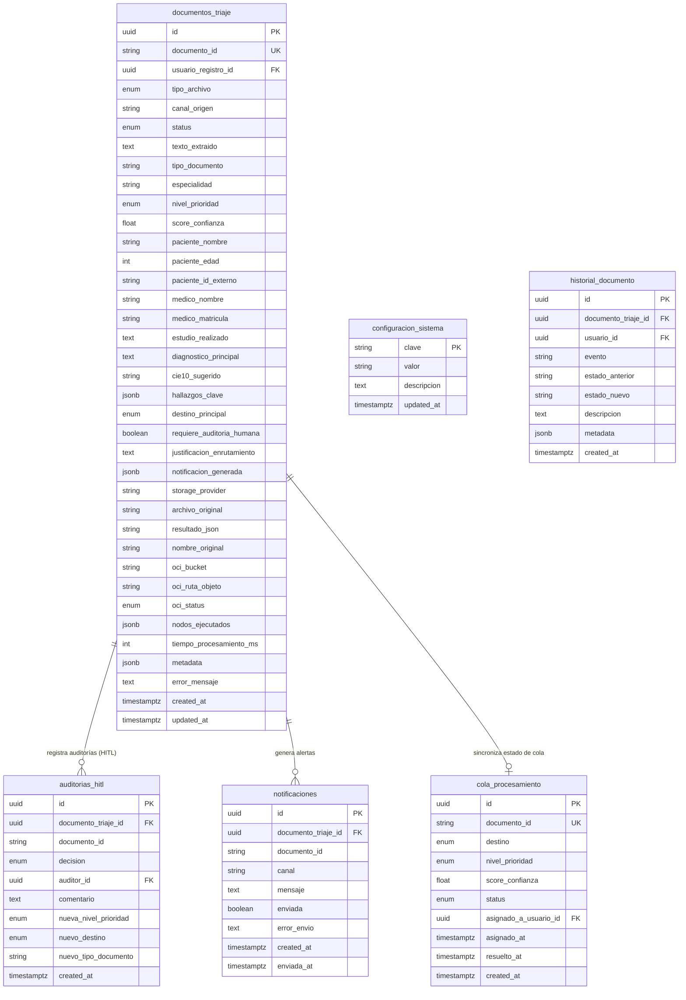

# 📚 Documentación de Base de Datos — MediFlow

Este documento describe la arquitectura, diccionario de datos, restricciones y script de comentarios de la base de datos **PostgreSQL 17** (`mediflow_dev`).

---

## 📐 Diagrama Entidad-Relación (Mermaid ER)

---

## 🗄️ Diccionario de Datos Completo

### 1. 📄 Tabla `documentos_triaje`
Almacena la extracción estructurada del LLM (Gemini / LangGraph), nivel de prioridad, enrutamiento, metadatos y ubicaciones físicas (`LOCAL` u `OCI`).

| Campo | Tipo | Restricciones | Descripción |
| :--- | :--- | :--- | :--- |
| `id` | `UUID` | `PRIMARY KEY`, `uuid_generate_v4()` | Clave primaria autogenerada. |
| `documento_id` | `VARCHAR(255)` | `UNIQUE`, `NOT NULL` | ID de negocio del documento (`DOC-XXXXXX`). |
| `tipo_archivo` | `tipo_archivo_enum` | `NOT NULL` | Formato (`PDF`, `IMAGEN`, `TEXTO`, `JSON`). |
| `canal_origen` | `VARCHAR(255)` | `NOT NULL DEFAULT ''` | Canal emisor (ej: `Guardia_Emergencias`). |
| `status` | `status_documento_enum` | `DEFAULT 'recibido'` | Estado del triaje (`recibido`, `procesando`, `procesado`, `pendiente_auditoria`, `rechazado`, `no_soportado`, `error`). |
| `usuario_registro_id` | `UUID` | `FK -> usuarios(id)` | Usuario autenticado que cargó o registró el documento. |
| `texto_extraido` | `TEXT` | NULL | Contenido de texto extraído por PyMuPDF/OCR. |
| `tipo_documento` | `VARCHAR(255)` | NULL | Clasificación del informe (ej: *Angio-TAC*, *Analítica*). |
| `especialidad` | `VARCHAR(255)` | NULL | Especialidad médica vinculada. |
| `nivel_prioridad` | `nivel_prioridad_enum` | NULL | Prioridad (`Urgente`, `Rutina`, `Ambiguo`). |
| `score_confianza` | `FLOAT` | `CHECK (0.0 <= score <= 1.0)` | Confianza calculada por el agente (0.0 a 1.0). |
| `paciente_nombre` | `VARCHAR(500)` | NULL | Nombre completo del paciente. |
| `paciente_edad` | `SMALLINT` | `CHECK (> 0 AND < 150)` | Edad del paciente. |
| `paciente_id_externo` | `VARCHAR(255)` | NULL | DNI, HC o identificador externo. |
| `medico_nombre` | `VARCHAR(500)` | NULL | Nombre del médico solicitante. |
| `medico_matricula` | `VARCHAR(100)` | NULL | Matrícula / Registro profesional. |
| `estudio_realizado` | `TEXT` | NULL | Nombre de la prueba o estudio médico. |
| `diagnostico_principal`| `TEXT` | NULL | Diagnóstico o impresión clínica. |
| `cie10_sugerido` | `VARCHAR(20)` | NULL | Código CIE-10 sugerido por el LLM. |
| `hallazgos_clave` | `JSONB` | `DEFAULT '[]'::JSONB` | Array con hallazgos clínicos clave. |
| `destino_principal` | `destino_enum` | NULL | Cola de destino asignada por enrutamiento. |
| `requiere_auditoria_humana` | `BOOLEAN` | `NOT NULL DEFAULT FALSE` | Indica si requiere revisión médica (HITL). |
| `justificacion_enrutamiento` | `TEXT` | NULL | Razón dada por la IA para su decisión. |
| `notificacion_generada` | `JSONB` | NULL | Detalle de la notificación de urgencia. |
| `storage_provider` | `VARCHAR(50)` | `DEFAULT 'LOCAL'` | Modo de almacenamiento activo (`LOCAL` \| `OCI`). |
| `archivo_original` | `VARCHAR(500)` | NULL | Ruta física o Key del archivo original. |
| `resultado_json` | `VARCHAR(500)` | NULL | Ruta física o Key del JSON procesado. |
| `nombre_original` | `VARCHAR(500)` | NULL | Nombre original subido por el cliente. |
| `oci_bucket` | `VARCHAR(255)` | NULL | Bucket de Oracle Cloud Object Storage. |
| `oci_ruta_objeto` | `VARCHAR(1000)`| NULL | Key del objeto en OCI. |
| `oci_status` | `status_oci_enum` | `DEFAULT 'pendiente'` | Estado del respaldo en OCI (`exito`, `error`, `pendiente`). |
| `nodos_ejecutados` | `JSONB` | `DEFAULT '[]'::JSONB` | Grafo de nodos ejecutados por LangGraph. |
| `tiempo_procesamiento_ms` | `INTEGER` | NULL | Tiempo de respuesta del flujo (ms). |
| `metadata` | `JSONB` | `DEFAULT '{}'::JSONB` | Metadatos contextuales adicionales. |
| `error_mensaje` | `TEXT` | NULL | Traza de error en caso de fallo. |
| `created_at` | `TIMESTAMPTZ` | `NOT NULL DEFAULT NOW()` | Fecha y hora de creación. |
| `updated_at` | `TIMESTAMPTZ` | `NOT NULL DEFAULT NOW()` | Fecha y hora de modificación. |

---

### 2. 👨‍⚕️ Tabla `auditorias_hitl`
Registra las decisiones tomadas por auditores clínicos (Human-in-the-Loop).

| Campo | Tipo | Restricciones | Descripción |
| :--- | :--- | :--- | :--- |
| `id` | `UUID` | `PRIMARY KEY`, `uuid_generate_v4()` | Clave primaria autogenerada. |
| `documento_triaje_id` | `UUID` | `FK -> documentos_triaje(id) ON DELETE CASCADE` | FK al documento de triaje. |
| `documento_id` | `VARCHAR(255)` | `NOT NULL` | ID de negocio del documento. |
| `decision` | `decision_auditoria_enum` | `NOT NULL` | Accion (`aprobar`, `rechazar`, `reclasificar`). |
| `auditor_id` | `UUID` | `NOT NULL`, `FK -> usuarios(id)` | Usuario autenticado que tomó la decisión HITL. |
| `comentario` | `TEXT` | NULL | Observaciones del auditor. |
| `nueva_nivel_prioridad` | `nivel_prioridad_enum` | NULL | Nueva prioridad si fue reclasificado. |
| `nuevo_destino` | `destino_enum` | NULL | Nuevo destino asignado. |
| `nuevo_tipo_documento` | `VARCHAR(255)` | NULL | Nuevo tipo de documento asignado. |
| `created_at` | `TIMESTAMPTZ` | `NOT NULL DEFAULT NOW()` | Fecha y hora de la auditoría. |

---

### 3. ⚙️ Tabla `configuracion_sistema`
Guarda la configuración persistente del sistema (ej: preferencia de almacenamiento `LOCAL` u `OCI`).

| Campo | Tipo | Restricciones | Descripción |
| :--- | :--- | :--- | :--- |
| `clave` | `VARCHAR(100)` | `PRIMARY KEY` | Clave identificadora (ej: `'modo_almacenamiento'`). |
| `valor` | `VARCHAR(500)` | `NOT NULL` | Valor activo (`'LOCAL'` u `'OCI'`). |
| `descripcion` | `TEXT` | NULL | Descripción del parámetro. |
| `updated_at` | `TIMESTAMPTZ` | `NOT NULL DEFAULT NOW()` | Última fecha de cambio. |

---

### 4. 🔔 Tabla `notificaciones`
Bitácora de alertas de emergencias médicas enviadas.

| Campo | Tipo | Restricciones | Descripción |
| :--- | :--- | :--- | :--- |
| `id` | `UUID` | `PRIMARY KEY`, `uuid_generate_v4()` | Clave primaria autogenerada. |
| `documento_triaje_id` | `UUID` | `FK -> documentos_triaje(id) ON DELETE CASCADE` | FK al documento. |
| `documento_id` | `VARCHAR(255)` | `NOT NULL` | ID de negocio. |
| `canal` | `VARCHAR(255)` | `NOT NULL` | Canal de la notificación (ej: `Guardia_Emergencias`). |
| `mensaje` | `TEXT` | `NOT NULL` | Mensaje de alerta clínica. |
| `enviada` | `BOOLEAN` | `NOT NULL DEFAULT FALSE` | Flag de confirmación de envío. |
| `error_envio` | `TEXT` | NULL | Detalle del error si falló. |
| `created_at` | `TIMESTAMPTZ` | `NOT NULL DEFAULT NOW()` | Fecha de creación. |
| `enviada_at` | `TIMESTAMPTZ` | NULL | Fecha de confirmación de envío. |

---

### 5. ⏳ Tabla `cola_procesamiento`
Control y gestión de la cola de trabajo clínica por destino.

| Campo | Tipo | Restricciones | Descripción |
| :--- | :--- | :--- | :--- |
| `id` | `UUID` | `PRIMARY KEY`, `uuid_generate_v4()` | Clave primaria. |
| `documento_id` | `VARCHAR(255)` | `UNIQUE`, `NOT NULL` | ID de negocio del documento. |
| `destino` | `destino_enum` | `NOT NULL` | Cola asignada. |
| `nivel_prioridad` | `nivel_prioridad_enum` | NULL | Nivel de prioridad. |
| `score_confianza` | `FLOAT` | NULL | Score de confianza. |
| `status` | `status_documento_enum` | `DEFAULT 'recibido'` | Estado en la cola. |
| `asignado_a_usuario_id` | `UUID` | `FK -> usuarios(id)` | Usuario/Médico asignado. |
| `asignado_at` | `TIMESTAMPTZ` | NULL | Fecha de asignación. |
| `resuelto_at` | `TIMESTAMPTZ` | NULL | Fecha de resolución. |
| `created_at` | `TIMESTAMPTZ` | `NOT NULL DEFAULT NOW()` | Fecha de ingreso a la cola. |
