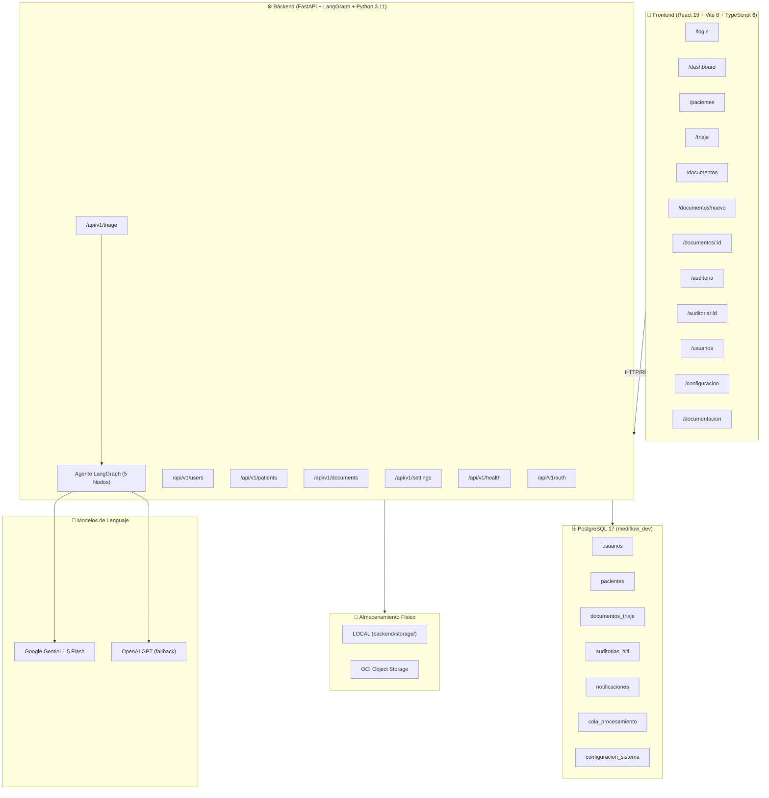
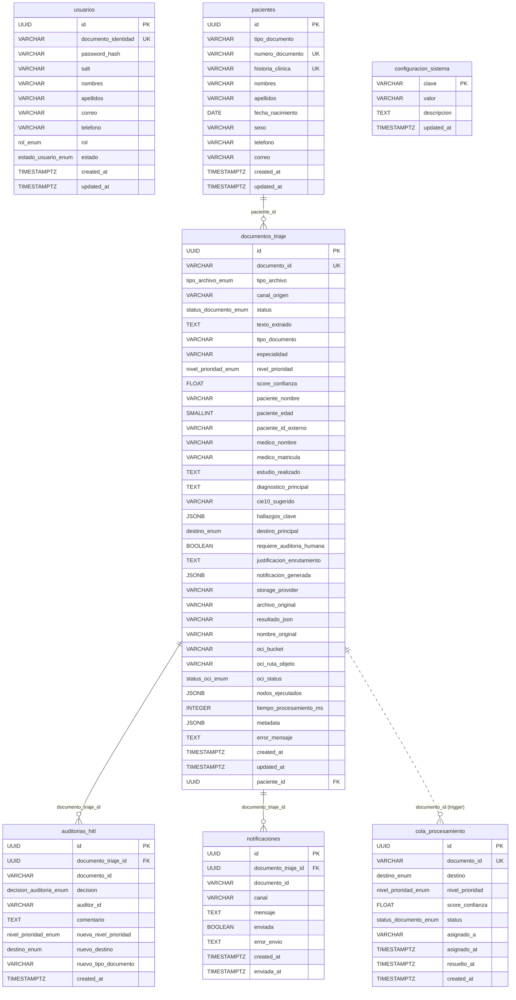
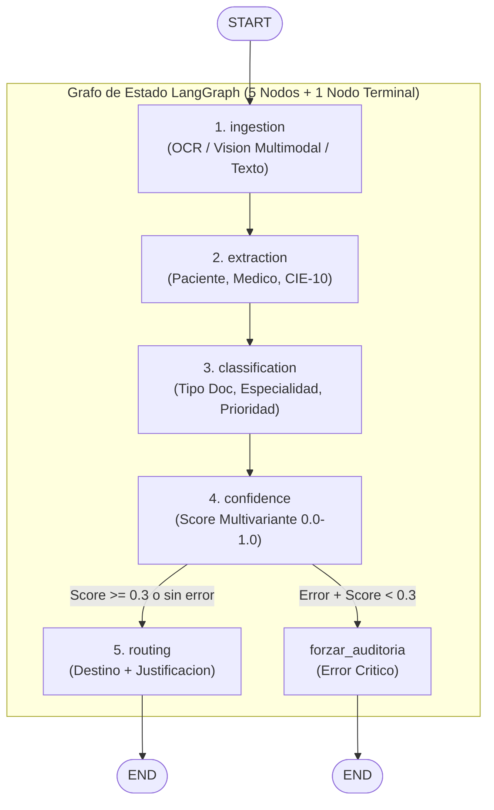
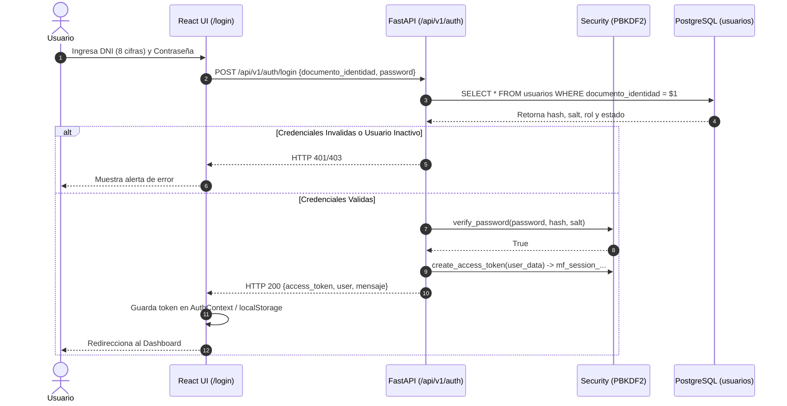
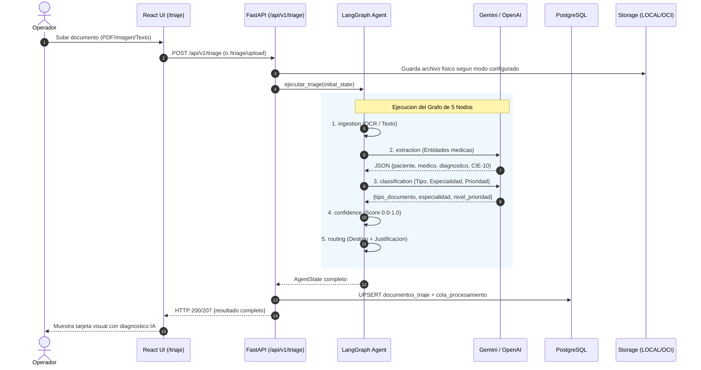
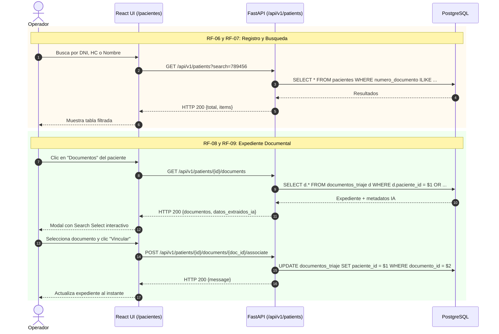
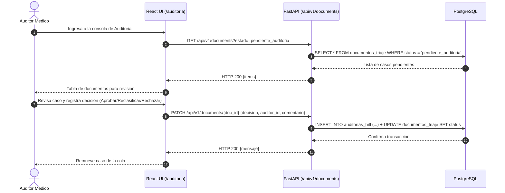
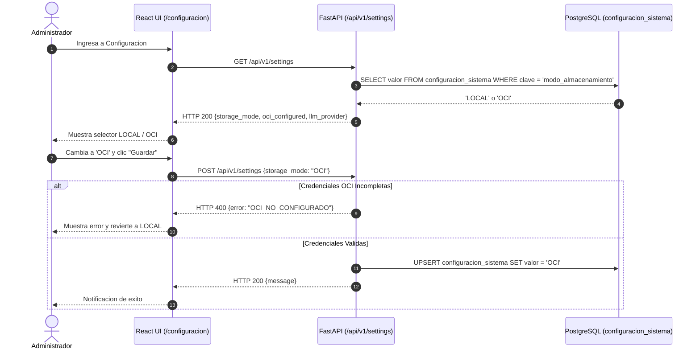
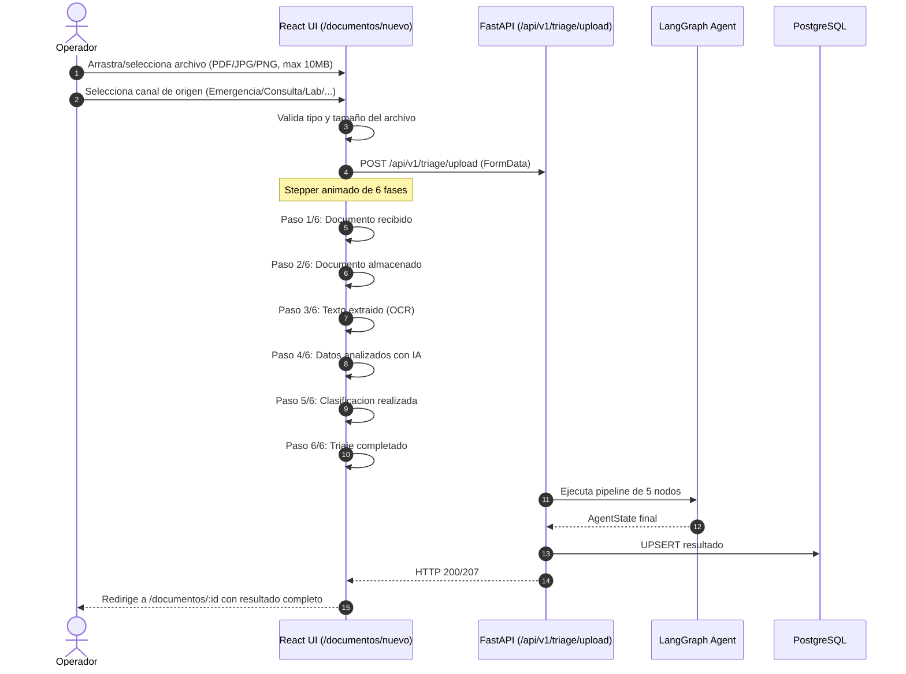

# 🏥 MediFlow — Especificación Técnica Completa del Sistema

> **Versión**: 1.0.0  
> **Fecha de generación**: 2026-09-25  
> **Autor de generación**: Erick Pariona  
> **Motor de Base de Datos**: PostgreSQL 17  
> **Stack Backend**: FastAPI + LangGraph + asyncpg + Pydantic v2  
> **Stack Frontend**: React 19 + TypeScript 6 + Vite 8 + Bootstrap 5.3  
> **Agente IA**: LangGraph (5 nodos) + Google Gemini / OpenAI (fallback)

---

## Tabla de Contenidos

1. [Arquitectura General del Sistema](#1-arquitectura-general-del-sistema)
2. [Modelo Relacional Completo (PostgreSQL)](#2-modelo-relacional-completo-postgresql)
3. [Catálogo de Tipos ENUM](#3-catálogo-de-tipos-enum)
4. [Catálogo de Índices](#4-catálogo-de-índices)
5. [Funciones, Triggers y Vistas SQL](#5-funciones-triggers-y-vistas-sql)
6. [Historial de Migraciones Alembic](#6-historial-de-migraciones-alembic)
7. [Repositorios de Acceso a Datos](#7-repositorios-de-acceso-a-datos)
8. [API REST - Catálogo Completo de Endpoints](#8-api-rest---catálogo-completo-de-endpoints)
9. [Esquemas Pydantic (Request/Response)](#9-esquemas-pydantic-requestresponse)
10. [Agente Autónomo de Triaje (LangGraph)](#10-agente-autónomo-de-triaje-langgraph)
11. [Seguridad y Autenticación](#11-seguridad-y-autenticación)
12. [Frontend - Rutas y Componentes](#12-frontend---rutas-y-componentes)
13. [Cliente API del Frontend](#13-cliente-api-del-frontend)
14. [Interfaces TypeScript](#14-interfaces-typescript)
15. [Infraestructura Docker y Despliegue](#15-infraestructura-docker-y-despliegue)
16. [Variables de Entorno](#16-variables-de-entorno)
17. [Flujos de Negocio Detallados](#17-flujos-de-negocio-detallados)

---

## 1. Arquitectura General del Sistema



### Puertos y URLs de Acceso

| Servicio | URL | Puerto |
| :--- | :--- | :--- |
| Frontend (Vite Dev) | `http://localhost:5173` | 5173 |
| Backend (Uvicorn) | `http://localhost:8000` | 8000 |
| Swagger UI | `http://localhost:8000/docs` | 8000 |
| ReDoc | `http://localhost:8000/redoc` | 8000 |
| PostgreSQL | `localhost` | 5432 |
| pgAdmin | `http://localhost:5050` | 5050 |

---

## 2. Modelo Relacional Completo (PostgreSQL)

### Diagrama Entidad-Relación



---

### 2.1 Tabla `documentos_triaje` (37 columnas)

> Resultado completo del triaje de cada documento clinico procesado por el agente autonomo.

| # | Columna | Tipo | Nullable | Default | Restricciones |
| :- | :--- | :--- | :--- | :--- | :--- |
| 1 | `id` | `UUID` | NO | `uuid_generate_v4()` | `PRIMARY KEY` |
| 2 | `documento_id` | `VARCHAR(255)` | NO | - | `UNIQUE`, Indice `idx_dt_documento_id` |
| 3 | `tipo_archivo` | `tipo_archivo_enum` | NO | - | ENUM |
| 4 | `canal_origen` | `VARCHAR(255)` | NO | `''` | Indice `idx_dt_canal_origen` |
| 5 | `status` | `status_documento_enum` | NO | `'pendiente_auditoria'` | ENUM, Indice `idx_dt_status` |
| 6 | `texto_extraido` | `TEXT` | SI | - | - |
| 7 | `tipo_documento` | `VARCHAR(255)` | SI | - | - |
| 8 | `especialidad` | `VARCHAR(255)` | SI | - | - |
| 9 | `nivel_prioridad` | `nivel_prioridad_enum` | SI | - | ENUM, Indice `idx_dt_nivel_prioridad` |
| 10 | `score_confianza` | `FLOAT` | SI | - | `CHECK (>= 0 AND <= 1)` |
| 11 | `paciente_nombre` | `VARCHAR(500)` | SI | - | Indice GIN trgm `idx_dt_paciente_trgm` |
| 12 | `paciente_edad` | `SMALLINT` | SI | - | `CHECK (> 0 AND < 150)` |
| 13 | `paciente_id_externo` | `VARCHAR(255)` | SI | - | - |
| 14 | `medico_nombre` | `VARCHAR(500)` | SI | - | - |
| 15 | `medico_matricula` | `VARCHAR(100)` | SI | - | - |
| 16 | `estudio_realizado` | `TEXT` | SI | - | - |
| 17 | `diagnostico_principal` | `TEXT` | SI | - | Indice GIN trgm `idx_dt_diagnostico_trgm` |
| 18 | `cie10_sugerido` | `VARCHAR(20)` | SI | - | - |
| 19 | `hallazgos_clave` | `JSONB` | SI | `'[]'::JSONB` | - |
| 20 | `destino_principal` | `destino_enum` | SI | - | ENUM, Indice `idx_dt_destino` |
| 21 | `requiere_auditoria_humana` | `BOOLEAN` | NO | `FALSE` | Indice Parcial `idx_dt_requiere_auditoria` |
| 22 | `justificacion_enrutamiento` | `TEXT` | SI | - | - |
| 23 | `notificacion_generada` | `JSONB` | SI | - | - |
| 24 | `storage_provider` | `VARCHAR(50)` | NO | `'LOCAL'` | - |
| 25 | `archivo_original` | `VARCHAR(1000)` | SI | - | - |
| 26 | `resultado_json` | `VARCHAR(1000)` | SI | - | - |
| 27 | `nombre_original` | `VARCHAR(500)` | SI | - | - |
| 28 | `oci_bucket` | `VARCHAR(255)` | SI | - | - |
| 29 | `oci_ruta_objeto` | `VARCHAR(1000)` | SI | - | - |
| 30 | `oci_status` | `status_oci_enum` | SI | `'pendiente'` | ENUM |
| 31 | `nodos_ejecutados` | `JSONB` | SI | `'[]'::JSONB` | - |
| 32 | `tiempo_procesamiento_ms` | `INTEGER` | SI | - | - |
| 33 | `metadata` | `JSONB` | SI | `'{}'::JSONB` | - |
| 34 | `error_mensaje` | `TEXT` | SI | - | - |
| 35 | `created_at` | `TIMESTAMPTZ` | NO | `NOW()` | Indice DESC `idx_dt_created_at` |
| 36 | `updated_at` | `TIMESTAMPTZ` | NO | `NOW()` | Trigger `set_updated_at` |
| 37 | `paciente_id` | `UUID` | SI | - | `FK -> pacientes(id) ON DELETE SET NULL` |

---

### 2.2 Tabla `auditorias_hitl` (10 columnas)

> Registro de decisiones de auditoria humana (Human-in-the-Loop) sobre documentos ambiguos.

| # | Columna | Tipo | Nullable | Default | Restricciones |
| :- | :--- | :--- | :--- | :--- | :--- |
| 1 | `id` | `UUID` | NO | `uuid_generate_v4()` | `PRIMARY KEY` |
| 2 | `documento_triaje_id` | `UUID` | NO | - | `FK -> documentos_triaje(id) ON DELETE CASCADE` |
| 3 | `documento_id` | `VARCHAR(255)` | NO | - | Indice `idx_ahitl_documento_id` |
| 4 | `decision` | `decision_auditoria_enum` | NO | - | ENUM |
| 5 | `auditor_id` | `VARCHAR(255)` | NO | - | Indice `idx_ahitl_auditor` |
| 6 | `comentario` | `TEXT` | SI | - | - |
| 7 | `nueva_nivel_prioridad` | `nivel_prioridad_enum` | SI | - | ENUM |
| 8 | `nuevo_destino` | `destino_enum` | SI | - | ENUM |
| 9 | `nuevo_tipo_documento` | `VARCHAR(255)` | SI | - | - |
| 10 | `created_at` | `TIMESTAMPTZ` | NO | `NOW()` | Indice DESC `idx_ahitl_created_at` |

---

### 2.3 Tabla `notificaciones` (9 columnas)

> Alertas generadas automaticamente para casos de urgencia medica.

| # | Columna | Tipo | Nullable | Default | Restricciones |
| :- | :--- | :--- | :--- | :--- | :--- |
| 1 | `id` | `UUID` | NO | `uuid_generate_v4()` | `PRIMARY KEY` |
| 2 | `documento_triaje_id` | `UUID` | NO | - | `FK -> documentos_triaje(id) ON DELETE CASCADE` |
| 3 | `documento_id` | `VARCHAR(255)` | NO | - | Indice `idx_notif_documento_id` |
| 4 | `canal` | `VARCHAR(255)` | NO | - | - |
| 5 | `mensaje` | `TEXT` | NO | - | - |
| 6 | `enviada` | `BOOLEAN` | NO | `FALSE` | Indice Parcial `idx_notif_enviada` WHERE FALSE |
| 7 | `error_envio` | `TEXT` | SI | - | - |
| 8 | `created_at` | `TIMESTAMPTZ` | NO | `NOW()` | - |
| 9 | `enviada_at` | `TIMESTAMPTZ` | SI | - | - |

---

### 2.4 Tabla `cola_procesamiento` (10 columnas)

> Vista logica materializada para el control de la cola de triaje clinico.

| # | Columna | Tipo | Nullable | Default | Restricciones |
| :- | :--- | :--- | :--- | :--- | :--- |
| 1 | `id` | `UUID` | NO | `uuid_generate_v4()` | `PRIMARY KEY` |
| 2 | `documento_id` | `VARCHAR(255)` | NO | - | `UNIQUE` |
| 3 | `destino` | `destino_enum` | NO | - | ENUM |
| 4 | `nivel_prioridad` | `nivel_prioridad_enum` | SI | - | ENUM |
| 5 | `score_confianza` | `FLOAT` | SI | - | - |
| 6 | `status` | `status_documento_enum` | NO | `'pendiente_auditoria'` | ENUM |
| 7 | `asignado_a` | `VARCHAR(255)` | SI | - | - |
| 8 | `asignado_at` | `TIMESTAMPTZ` | SI | - | - |
| 9 | `resuelto_at` | `TIMESTAMPTZ` | SI | - | - |
| 10 | `created_at` | `TIMESTAMPTZ` | NO | `NOW()` | Indice Compuesto `idx_cola_destino_status` |

---

### 2.5 Tabla `configuracion_sistema` (4 columnas)

> Almacena la configuracion global persistente del sistema.

| # | Columna | Tipo | Nullable | Default | Restricciones |
| :- | :--- | :--- | :--- | :--- | :--- |
| 1 | `clave` | `VARCHAR(100)` | NO | - | `PRIMARY KEY` |
| 2 | `valor` | `VARCHAR(500)` | NO | - | - |
| 3 | `descripcion` | `TEXT` | SI | - | - |
| 4 | `updated_at` | `TIMESTAMPTZ` | NO | `NOW()` | - |

---

### 2.6 Tabla `usuarios` (12 columnas)

> Registro central de usuarios del sistema MediFlow con control de acceso basado en roles (RBAC).

| # | Columna | Tipo | Nullable | Default | Restricciones |
| :- | :--- | :--- | :--- | :--- | :--- |
| 1 | `id` | `UUID` | NO | `uuid_generate_v4()` | `PRIMARY KEY` |
| 2 | `documento_identidad` | `VARCHAR(8)` | NO | - | `UNIQUE` |
| 3 | `password_hash` | `VARCHAR(255)` | NO | - | - |
| 4 | `salt` | `VARCHAR(64)` | NO | - | - |
| 5 | `nombres` | `VARCHAR(250)` | NO | - | - |
| 6 | `apellidos` | `VARCHAR(250)` | NO | - | - |
| 7 | `correo` | `VARCHAR(250)` | SI | - | - |
| 8 | `telefono` | `VARCHAR(50)` | SI | - | - |
| 9 | `rol` | `rol_enum` | NO | `'OPERADOR'` | ENUM |
| 10 | `estado` | `estado_usuario_enum` | NO | `'ACTIVO'` | ENUM |
| 11 | `created_at` | `TIMESTAMPTZ` | NO | `NOW()` | - |
| 12 | `updated_at` | `TIMESTAMPTZ` | NO | `NOW()` | - |

---

### 2.7 Tabla `pacientes` (12 columnas)

> Tabla maestra de pacientes registrados en el sistema MediFlow.

| # | Columna | Tipo | Nullable | Default | Restricciones |
| :- | :--- | :--- | :--- | :--- | :--- |
| 1 | `id` | `UUID` | NO | `uuid_generate_v4()` | `PRIMARY KEY` |
| 2 | `tipo_documento` | `VARCHAR(20)` | NO | `'DNI'` | - |
| 3 | `numero_documento` | `VARCHAR(30)` | NO | - | `UNIQUE`, Indice `idx_pacientes_numero_doc` |
| 4 | `historia_clinica` | `VARCHAR(50)` | SI | - | `UNIQUE`, Indice `idx_pacientes_historia_clinica` |
| 5 | `nombres` | `VARCHAR(250)` | NO | - | Indice compuesto `idx_pacientes_nombres_apellidos` |
| 6 | `apellidos` | `VARCHAR(250)` | NO | - | Indice compuesto `idx_pacientes_nombres_apellidos` |
| 7 | `fecha_nacimiento` | `DATE` | SI | - | - |
| 8 | `sexo` | `VARCHAR(20)` | SI | - | - |
| 9 | `telefono` | `VARCHAR(50)` | SI | - | - |
| 10 | `correo` | `VARCHAR(250)` | SI | - | - |
| 11 | `created_at` | `TIMESTAMPTZ` | NO | `NOW()` | - |
| 12 | `updated_at` | `TIMESTAMPTZ` | NO | `NOW()` | - |

---

### 2.8 Resumen de Relaciones (Foreign Keys)

| FK | Tabla Origen | Columna | Tabla Destino | Columna Destino | Comportamiento ON DELETE |
| :--- | :--- | :--- | :--- | :--- | :--- |
| FK1 | `auditorias_hitl` | `documento_triaje_id` | `documentos_triaje` | `id` | `CASCADE` |
| FK2 | `notificaciones` | `documento_triaje_id` | `documentos_triaje` | `id` | `CASCADE` |
| FK3 | `documentos_triaje` | `paciente_id` | `pacientes` | `id` | `SET NULL` |
| Trigger | `cola_procesamiento` | `documento_id` | `documentos_triaje` | `documento_id` | Sincronizado via trigger |

---

## 3. Catálogo de Tipos ENUM

| # | Nombre | Valores |
| :- | :--- | :--- |
| 1 | `tipo_archivo_enum` | `'PDF'`, `'IMAGEN'`, `'TEXTO'`, `'JSON'` |
| 2 | `nivel_prioridad_enum` | `'Urgente'`, `'Rutina'`, `'Ambiguo'` |
| 3 | `status_documento_enum` | `'procesado'`, `'error'`, `'pendiente_auditoria'` |
| 4 | `destino_enum` | `'Cola_Emergencia_Medica'`, `'Cola_Rutina'`, `'Cola_Auditoria_Humana'` |
| 5 | `status_oci_enum` | `'exito'`, `'error'`, `'pendiente'` |
| 6 | `decision_auditoria_enum` | `'aprobar'`, `'rechazar'`, `'reclasificar'` |
| 7 | `rol_enum` | `'ADMINISTRADOR'`, `'OPERADOR'`, `'AUDITOR'`, `'SUPERVISOR'` |
| 8 | `estado_usuario_enum` | `'ACTIVO'`, `'INACTIVO'` |

---

## 4. Catálogo de Índices

| # | Nombre | Tabla | Columna(s) | Tipo |
| :- | :--- | :--- | :--- | :--- |
| 1 | `idx_dt_documento_id` | `documentos_triaje` | `documento_id` | B-Tree |
| 2 | `idx_dt_status` | `documentos_triaje` | `status` | B-Tree |
| 3 | `idx_dt_nivel_prioridad` | `documentos_triaje` | `nivel_prioridad` | B-Tree |
| 4 | `idx_dt_destino` | `documentos_triaje` | `destino_principal` | B-Tree |
| 5 | `idx_dt_requiere_auditoria` | `documentos_triaje` | `requiere_auditoria_humana` | Parcial (WHERE TRUE) |
| 6 | `idx_dt_created_at` | `documentos_triaje` | `created_at DESC` | B-Tree |
| 7 | `idx_dt_canal_origen` | `documentos_triaje` | `canal_origen` | B-Tree |
| 8 | `idx_dt_diagnostico_trgm` | `documentos_triaje` | `diagnostico_principal` | GIN (pg_trgm) |
| 9 | `idx_dt_paciente_trgm` | `documentos_triaje` | `paciente_nombre` | GIN (pg_trgm) |
| 10 | `idx_ahitl_documento_id` | `auditorias_hitl` | `documento_id` | B-Tree |
| 11 | `idx_ahitl_auditor` | `auditorias_hitl` | `auditor_id` | B-Tree |
| 12 | `idx_ahitl_created_at` | `auditorias_hitl` | `created_at DESC` | B-Tree |
| 13 | `idx_notif_enviada` | `notificaciones` | `enviada` | Parcial (WHERE FALSE) |
| 14 | `idx_notif_documento_id` | `notificaciones` | `documento_id` | B-Tree |
| 15 | `idx_cola_destino_status` | `cola_procesamiento` | `(destino, status)` | Compuesto B-Tree |
| 16 | `idx_pacientes_numero_doc` | `pacientes` | `numero_documento` | B-Tree |
| 17 | `idx_pacientes_historia_clinica` | `pacientes` | `historia_clinica` | B-Tree |
| 18 | `idx_pacientes_nombres_apellidos` | `pacientes` | `(nombres, apellidos)` | Compuesto B-Tree |

---

## 5. Funciones, Triggers y Vistas SQL

### 5.1 Funciones y Triggers

**`trigger_set_updated_at()`**: Actualiza automaticamente el campo `updated_at` al momento actual cuando se modifica un registro.

```sql
CREATE OR REPLACE FUNCTION trigger_set_updated_at()
RETURNS TRIGGER AS $$
BEGIN
    NEW.updated_at = NOW();
    RETURN NEW;
END;
$$ LANGUAGE plpgsql;

-- Trigger aplicado:
CREATE TRIGGER set_updated_at_documentos_triaje
    BEFORE UPDATE ON documentos_triaje
    FOR EACH ROW EXECUTE FUNCTION trigger_set_updated_at();
```

**`sincronizar_cola()`**: Sincroniza automaticamente la tabla `cola_procesamiento` cuando se inserta o actualiza un documento en `documentos_triaje`.

```sql
CREATE OR REPLACE FUNCTION sincronizar_cola()
RETURNS TRIGGER AS $$
BEGIN
    IF NEW.destino_principal IS NOT NULL THEN
        INSERT INTO cola_procesamiento (
            documento_id, destino, nivel_prioridad, score_confianza, status
        ) VALUES (
            NEW.documento_id, NEW.destino_principal,
            NEW.nivel_prioridad, NEW.score_confianza, NEW.status
        )
        ON CONFLICT (documento_id) DO UPDATE SET
            destino         = EXCLUDED.destino,
            nivel_prioridad = EXCLUDED.nivel_prioridad,
            score_confianza = EXCLUDED.score_confianza,
            status          = EXCLUDED.status;
    END IF;
    RETURN NEW;
END;
$$ LANGUAGE plpgsql;

-- Trigger aplicado:
CREATE TRIGGER trigger_sincronizar_cola
    AFTER INSERT OR UPDATE ON documentos_triaje
    FOR EACH ROW EXECUTE FUNCTION sincronizar_cola();
```

### 5.2 Vistas SQL

**`v_urgentes_pendientes`**: Casos urgentes procesados exitosamente.
```sql
CREATE OR REPLACE VIEW v_urgentes_pendientes AS
SELECT documento_id, tipo_documento, paciente_nombre, diagnostico_principal,
       score_confianza, canal_origen, created_at, tiempo_procesamiento_ms
FROM documentos_triaje
WHERE nivel_prioridad = 'Urgente' AND status = 'procesado'
ORDER BY created_at DESC;
```

**`v_auditoria_pendiente`**: Casos pendientes de revision humana (HITL).
```sql
CREATE OR REPLACE VIEW v_auditoria_pendiente AS
SELECT documento_id, tipo_documento, paciente_nombre, diagnostico_principal,
       score_confianza, nivel_prioridad, justificacion_enrutamiento,
       error_mensaje, created_at
FROM documentos_triaje
WHERE requiere_auditoria_humana = TRUE AND status = 'pendiente_auditoria'
ORDER BY created_at ASC;
```

**`v_estadisticas_hoy`**: Metricas agregadas del dia actual.
```sql
CREATE OR REPLACE VIEW v_estadisticas_hoy AS
SELECT
    COUNT(*) FILTER (WHERE status = 'procesado')           AS procesados_ok,
    COUNT(*) FILTER (WHERE status = 'pendiente_auditoria') AS en_auditoria,
    COUNT(*) FILTER (WHERE status = 'error')               AS errores,
    COUNT(*) FILTER (WHERE nivel_prioridad = 'Urgente')    AS urgentes,
    COUNT(*) FILTER (WHERE nivel_prioridad = 'Rutina')     AS rutina,
    COUNT(*) FILTER (WHERE nivel_prioridad = 'Ambiguo')    AS ambiguos,
    ROUND(AVG(score_confianza)::NUMERIC, 3)                AS score_promedio,
    ROUND(AVG(tiempo_procesamiento_ms)::NUMERIC, 0)        AS tiempo_ms_promedio,
    COUNT(*)                                               AS total
FROM documentos_triaje
WHERE created_at >= CURRENT_DATE;
```

---

## 6. Historial de Migraciones Alembic

```
a3eb75cf454e (initial_schema)           -- Tablas base + ENUMs + Triggers + Vistas
  └── 6bf254b9874e (configuracion)      -- Tabla configuracion_sistema
        └── c1f893021ab3 (storage)      -- Columna storage_provider
              └── e7f893021ab4 (rutas)  -- Columnas archivo_original + resultado_json
                    └── f8g990032bc5    -- Columna nombre_original
                          └── g9h001143cd6 (comments) -- COMMENT ON TABLE/COLUMN
                                └── h1i202255de7 (auth) -- Tabla usuarios + RBAC ENUMs
                                      └── i2j302266ef8 (pacientes) -- Tabla pacientes + FK [HEAD]
```

---

## 7. Repositorios de Acceso a Datos

### 7.1 `PostgresStorageRepository` (`repositories/postgres_storage.py`)

| Metodo | Query SQL Principal | Descripcion |
| :--- | :--- | :--- |
| `guardar_resultado()` | `INSERT INTO documentos_triaje (...) ON CONFLICT (documento_id) DO UPDATE SET ...` | UPSERT de 32 campos del resultado de triaje |
| `obtener_por_id()` | `SELECT * FROM documentos_triaje WHERE documento_id = $1` | Consulta por ID de negocio |
| `listar()` | `SELECT * FROM documentos_triaje WHERE ... ORDER BY created_at DESC LIMIT $n` | Listado con filtros opcionales |
| `registrar_auditoria()` | `INSERT INTO auditorias_hitl (...) + UPDATE documentos_triaje SET status = ...` | Registro transaccional de decision HITL |

### 7.2 `UserRepository` (`repositories/user_repository.py`)

| Metodo | Query SQL Principal |
| :--- | :--- |
| `get_user_by_document()` | `SELECT ... FROM usuarios WHERE documento_identidad = $1` |
| `get_user_by_id()` | `SELECT ... FROM usuarios WHERE id = $1::uuid` |
| `list_all_users()` | `SELECT ... FROM usuarios ORDER BY created_at DESC` |
| `create_user()` | `INSERT INTO usuarios (...) VALUES (...) RETURNING ...` |
| `update_user()` | `UPDATE usuarios SET ... WHERE id = $1::uuid RETURNING ...` |

### 7.3 `PatientRepository` (`repositories/patient_repository.py`)

| Metodo | Query SQL Principal |
| :--- | :--- |
| `list_patients()` | `SELECT ... FROM pacientes WHERE numero_documento ILIKE $1 OR historia_clinica ILIKE $1 OR nombres ILIKE $1 OR ...` |
| `get_patient_by_id()` | `SELECT ... FROM pacientes WHERE id = $1::uuid` |
| `get_patient_by_doc()` | `SELECT ... FROM pacientes WHERE numero_documento = $1` |
| `get_patient_by_hc()` | `SELECT ... FROM pacientes WHERE historia_clinica = $1` |
| `create_patient()` | `INSERT INTO pacientes (...) VALUES (...) RETURNING ...` |
| `update_patient()` | `UPDATE pacientes SET ... WHERE id = $1::uuid RETURNING ...` |
| `get_patient_documents()` | `SELECT d.* FROM documentos_triaje d WHERE d.paciente_id = $1::uuid OR d.paciente_id_externo = $2 OR ...` |
| `get_unlinked_documents()` | `SELECT ... FROM documentos_triaje WHERE paciente_id IS NULL LIMIT 50` |
| `associate_document_to_patient()` | `UPDATE documentos_triaje SET paciente_id = $1::uuid WHERE documento_id ILIKE $2` |

---

## 8. API REST - Catálogo Completo de Endpoints

### 8.1 Autenticacion (`/api/v1/auth`)

| Metodo | Ruta | Auth | Descripcion | Request Body | Response |
| :--- | :--- | :--- | :--- | :--- | :--- |
| `POST` | `/api/v1/auth/login` | Publica | RF-01: Inicio de sesion | `LoginRequest` | `LoginResponse` |
| `POST` | `/api/v1/auth/logout` | Bearer Token (opcional) | RF-02: Cierre de sesion | - | `{mensaje}` |
| `GET` | `/api/v1/auth/me` | Bearer Token | Consultar usuario autenticado | - | `UserResponse` |

### 8.2 Gestion de Usuarios (`/api/v1/users`)

| Metodo | Ruta | Auth | Descripcion | Request Body | Response |
| :--- | :--- | :--- | :--- | :--- | :--- |
| `GET` | `/api/v1/users` | Admin Token | RF-03: Listar usuarios | - | `List[UserResponse]` |
| `POST` | `/api/v1/users` | Admin Token | RF-03: Registrar usuario | `UserCreateRequest` | `UserResponse` (201) |
| `PUT` | `/api/v1/users/{user_id}` | Admin Token | RF-04: Modificar usuario | `UserUpdateRequest` | `UserResponse` |

### 8.3 Gestion de Pacientes (`/api/v1/patients`)

| Metodo | Ruta | Auth | Descripcion | Request Body | Response |
| :--- | :--- | :--- | :--- | :--- | :--- |
| `GET` | `/api/v1/patients` | Bearer Token | RF-07: Buscar pacientes | Query: `search` | `{total, items}` |
| `GET` | `/api/v1/patients/unlinked-documents` | Bearer Token | Documentos sin paciente | - | `{total, items}` |
| `POST` | `/api/v1/patients` | Bearer Token | RF-06: Registrar paciente | `PatientCreateRequest` | `{message, paciente}` (201) |
| `GET` | `/api/v1/patients/{id}` | Bearer Token | Detalle de paciente | - | `Paciente` |
| `PUT` | `/api/v1/patients/{id}` | Bearer Token | Actualizar paciente | `PatientUpdateRequest` | `{message, paciente}` |
| `GET` | `/api/v1/patients/{id}/documents` | Bearer Token | RF-08/09: Expediente documental | - | `HistorialDocumentos` |
| `POST` | `/api/v1/patients/{id}/documents/{doc_id}/associate` | Bearer Token | RF-08: Vincular documento | - | `{message}` |

### 8.4 Triaje y Agente IA (`/api/v1/triage`)

| Metodo | Ruta | Auth | Descripcion | Request Body | Response |
| :--- | :--- | :--- | :--- | :--- | :--- |
| `POST` | `/api/v1/triage` | Bearer Token | RF-11: Procesar documento (JSON) | `DocumentoClinicoRequest` | `AgentState` (200/207) |
| `POST` | `/api/v1/triage/upload` | Bearer Token | RF-10: Procesar archivo (multipart) | FormData: `documento_id`, `canal_origen`, `archivo` | `AgentState` (200/207) |

### 8.5 Documentos y Auditoria (`/api/v1/documents`)

| Metodo | Ruta | Auth | Descripcion | Query Params | Response |
| :--- | :--- | :--- | :--- | :--- | :--- |
| `GET` | `/api/v1/documents` | Bearer Token | Listar documentos procesados | `estado`, `nivel_prioridad`, `limit` | `{total, items}` |
| `GET` | `/api/v1/documents/{doc_id}` | Bearer Token | Obtener documento por ID | - | `dict` |
| `PATCH` | `/api/v1/documents/{doc_id}` | Bearer Token (AUDITOR/ADMINISTRADOR) | RF-14: Registrar decision HITL | `DecisionAuditoriaRequest` | `dict` |

### 8.6 Configuracion del Sistema (`/api/v1/settings`)

| Metodo | Ruta | Auth | Descripcion | Request Body | Response |
| :--- | :--- | :--- | :--- | :--- | :--- |
| `GET` | `/api/v1/settings` | Bearer Token (ADMINISTRADOR) | Obtener configuracion actual | - | `ConfigResponse` |
| `POST` | `/api/v1/settings` | Bearer Token (ADMINISTRADOR) | RF-15: Actualizar modo almacenamiento | `ConfigRequest` | `ConfigResponse` |

### 8.7 Health Check (`/health`)

| Metodo | Ruta | Auth | Descripcion | Response |
| :--- | :--- | :--- | :--- | :--- |
| `GET` | `/health` | Publica | Estado del servicio | `{status, version, llm_disponible, oci_disponible}` |
| `GET` | `/api/v1/health` | Publica | Estado del servicio (alias) | Idem |

---

## 9. Esquemas Pydantic (Request/Response)

### 9.1 Autenticacion

```python
class LoginRequest(BaseModel):
    documento_identidad: str  # Regex: ^\d{8}$
    password: str

class UserResponse(BaseModel):
    id: str
    documento_identidad: str
    nombres: str
    apellidos: str
    correo: Optional[str] = None
    telefono: Optional[str] = None
    rol: str
    estado: str
    created_at: Optional[str] = None

class LoginResponse(BaseModel):
    access_token: str
    token_type: str = "Bearer"
    user: UserResponse
    mensaje: str = "Inicio de sesion exitoso"
```

### 9.2 Usuarios

```python
class UserCreateRequest(BaseModel):
    documento_identidad: str  # Regex: ^\d{8}$
    password: str             # min_length=4
    nombres: str
    apellidos: str
    correo: Optional[str] = None
    telefono: Optional[str] = None
    rol: str = "OPERADOR"     # ADMINISTRADOR|OPERADOR|AUDITOR|SUPERVISOR
    estado: str = "ACTIVO"    # ACTIVO|INACTIVO

class UserUpdateRequest(BaseModel):
    nombres: Optional[str] = None
    apellidos: Optional[str] = None
    correo: Optional[str] = None
    telefono: Optional[str] = None
    rol: Optional[str] = None
    estado: Optional[str] = None
    password: Optional[str] = None
```

### 9.3 Pacientes

```python
class PatientCreateRequest(BaseModel):
    tipo_documento: str = "DNI"        # DNI|CE|PASAPORTE
    numero_documento: str              # No vacio
    historia_clinica: Optional[str] = None
    nombres: str
    apellidos: str
    fecha_nacimiento: Optional[str] = None  # AAAA-MM-DD
    sexo: Optional[str] = "M"
    telefono: Optional[str] = None
    correo: Optional[str] = None

class PatientUpdateRequest(BaseModel):
    # Todos los campos opcionales
    tipo_documento: Optional[str] = None
    numero_documento: Optional[str] = None
    historia_clinica: Optional[str] = None
    nombres: Optional[str] = None
    apellidos: Optional[str] = None
    fecha_nacimiento: Optional[str] = None
    sexo: Optional[str] = None
    telefono: Optional[str] = None
    correo: Optional[str] = None
```

### 9.4 Triaje

```python
class DocumentoClinicoRequest(BaseModel):
    documento_id: str
    tipo_archivo: str           # Regex: ^(PDF|IMAGEN|TEXTO|JSON)$
    documento_texto: Optional[str] = None
    documento_base64: Optional[str] = None
    canal_origen: str = ""
    metadata: Optional[dict] = None

class DecisionAuditoriaRequest(BaseModel):
    decision: Literal["aprobar", "rechazar", "reclasificar"]
    nueva_clasificacion: Optional[dict] = None
    comentario: Optional[str] = None
```

### 9.5 Configuracion

```python
class ConfigRequest(BaseModel):
    storage_mode: str   # Regex: ^(LOCAL|OCI)$

class ConfigResponse(BaseModel):
    storage_mode: str
    oci_configured: bool
    llm_provider: str
    llm_configured: bool
    database_url_configured: bool
```

### 9.6 Estado del Agente (AgentState)

```python
class PacienteState(BaseModel):
    nombre: Optional[str] = None
    edad: Optional[int] = None
    id_paciente: Optional[str] = None

class MedicoSolicitanteState(BaseModel):
    nombre: Optional[str] = None
    matricula: Optional[str] = None

class DatosExtraidosState(BaseModel):
    paciente: Optional[PacienteState] = None
    medico_solicitante: Optional[MedicoSolicitanteState] = None
    estudio_realizado: Optional[str] = None
    diagnostico_principal: Optional[str] = None
    cie10_sugerido: Optional[str] = None
    hallazgos_clave: list[str] = Field(default_factory=list)

class ClasificacionState(BaseModel):
    tipo_documento: Optional[str] = None
    especialidad: Optional[str] = None
    nivel_prioridad: Optional[Literal["Urgente", "Rutina", "Ambiguo"]] = None
    score_confianza_clasificacion: float = 0.0

class DecisionEnrutamientoState(BaseModel):
    destino_principal: Optional[Literal[
        "Cola_Emergencia_Medica", "Cola_Rutina", "Cola_Auditoria_Humana"
    ]] = None
    requiere_auditoria_humana: bool = False
    justificacion_enrutamiento: Optional[str] = None
    notificacion_generada: Optional[dict] = None

class AlmacenamientoOCIState(BaseModel):
    bucket: Optional[str] = None
    ruta_objeto: Optional[str] = None
    archivo_original: Optional[str] = None
    resultado_json: Optional[str] = None
    nombre_original: Optional[str] = None
    status_backup: Literal["exito", "error", "pendiente"] = "pendiente"

class AgentState(BaseModel):
    documento_id: str
    tipo_archivo: str
    documento_texto: Optional[str] = None
    documento_base64: Optional[str] = None
    canal_origen: str = ""
    metadata: dict = Field(default_factory=dict)
    texto_extraido: Optional[str] = None
    datos_extraidos: DatosExtraidosState
    clasificacion: ClasificacionState
    decision_enrutamiento: DecisionEnrutamientoState
    almacenamiento_oci: AlmacenamientoOCIState
    status: Literal["procesado", "error", "pendiente_auditoria"]
    error_mensaje: Optional[str] = None
    tiempo_procesamiento_ms: Optional[int] = None
    nodos_ejecutados: list[str] = Field(default_factory=list)
```

---

## 10. Agente Autónomo de Triaje (LangGraph)

### 10.1 Topología del Grafo



### 10.2 Detalle Nodo por Nodo

#### Nodo 1: `ingestion` (Normalizacion y Vision Multimodal)

| Aspecto | Detalle |
| :--- | :--- |
| **Funcion** | `node_ingestion(state: AgentState) -> dict` |
| **Entrada** | Archivo subido (PDF, Imagen, Texto, JSON) + `canal_origen` |
| **Logica** | Texto plano: extrae directamente. PDF: decodifica Base64 y extrae texto pagina por pagina con `PyMuPDF (fitz)`. Imagen: valida integridad Base64, difiere OCR a nodo extraction via LLM multimodal. |
| **Salida** | `texto_extraido`, `nodos_ejecutados += ["ingestion"]` |

#### Nodo 2: `extraction` (Extraccion de Entidades Medicas)

| Aspecto | Detalle |
| :--- | :--- |
| **Funcion** | `node_extraction(state, llm_service) -> dict` |
| **Entrada** | `texto_extraido` (truncado a 4000 chars) |
| **Prompt Medico** | Instruccion estricta para generar JSON con: `paciente {nombre, edad, id_paciente}`, `medico_solicitante {nombre, matricula}`, `estudio_realizado`, `diagnostico_principal`, `cie10_sugerido`, `hallazgos_clave[]` |
| **LLM** | `llm_service.completar(prompt)` o mock en desarrollo |
| **Salida** | `datos_extraidos: DatosExtraidosState`, `nodos_ejecutados += ["extraction"]` |

#### Nodo 3: `classification` (Especialidad y Prioridad Clinica)

| Aspecto | Detalle |
| :--- | :--- |
| **Funcion** | `node_classification(state, llm_service) -> dict` |
| **Entrada** | `datos_extraidos` + `texto_extraido` |
| **Clasificaciones** | `tipo_documento`: Receta, Laboratorio, Radiografia, Epicrisis, Derivacion. `especialidad`: Cardiologia, Neumologia, etc. `nivel_prioridad`: Urgente (valores criticos/riesgo vital), Rutina (controles normales), Ambiguo (datos contradictorios/ilegibles). |
| **Salida** | `clasificacion: ClasificacionState`, `nodos_ejecutados += ["classification"]` |

#### Nodo 4: `confidence` (Score Multivariante)

| Aspecto | Detalle |
| :--- | :--- |
| **Funcion** | `node_confidence(state) -> dict` (deterministico, sin LLM) |
| **Formula** | $\text{Score} = 0.35 \cdot C_{\text{paciente}} + 0.25 \cdot C_{\text{diagnostico}} + 0.20 \cdot C_{\text{cie10}} + 0.20 \cdot C_{\text{claridad}}$ |
| **Penalizacion** | Datos clave faltantes penalizan por debajo de 0.70. Campos coherentes alcanzan 0.85 - 1.00. |
| **Salida** | `clasificacion.score_confianza_clasificacion`, `nodos_ejecutados += ["confidence"]` |

#### Edge Condicional: `decidir_post_confidence`

```python
def decidir_post_confidence(state: AgentState) -> str:
    if state.error_mensaje and state.clasificacion.score_confianza_clasificacion < 0.3:
        return "forzar_auditoria"
    return "routing"
```

#### Nodo 5: `routing` (Enrutamiento Autonomo)

| Prioridad | Score | Destino | HITL | Status |
| :--- | :--- | :--- | :--- | :--- |
| Urgente | >= 0.85 | `Cola_Emergencia_Medica` | `False` | `procesado` |
| Rutina | >= 0.85 | `Cola_Rutina` | `False` | `procesado` |
| Ambiguo | Cualquiera | `Cola_Auditoria_Humana` | `True` | `pendiente_auditoria` |
| Cualquiera | < 0.85 | `Cola_Auditoria_Humana` | `True` | `pendiente_auditoria` |

#### Nodo Terminal: `forzar_auditoria`

Activado solo ante errores criticos con score < 0.3. Fuerza derivacion a auditoria humana con justificacion "Error critico en procesamiento".

---

## 11. Seguridad y Autenticacion

### 11.1 Hashing de Contraseñas
- **Algoritmo**: PBKDF2-HMAC-SHA256
- **Iteraciones**: 100,000
- **Salt**: 16 bytes aleatorios criptograficos (`secrets.token_hex(16)`)
- **Verificacion**: Comparacion en tiempo constante (`secrets.compare_digest`)

### 11.2 Gestion de Sesiones
- **Token**: `mf_session_{secrets.token_hex(32)}` (64 chars hex)
- **Almacenamiento**: En memoria (`_ACTIVE_SESSIONS: Dict[str, dict]`)
- **Expiracion**: 12 horas desde generacion
- **Invalidacion**: `invalidate_access_token()` elimina la entrada

### 11.3 Mecanismos de Autenticacion

| Mecanismo | Header | Uso | Endpoints |
| :--- | :--- | :--- | :--- |
| Bearer Token | `Authorization: Bearer mf_session_...` | Sesion de usuario | `/auth/me`, `/users/*`, `/patients/*` |
| API Key | `X-API-Key: mediflow-dev-...` | Acceso programatico | `/triage/*`, `/documents/*`, `/settings/*` |
| Flexible | Ambos | Cualquiera de los dos | `/patients/*` |

### 11.4 Control de Acceso RBAC

| Rol | `/login` | `/dashboard` | `/triaje` | `/pacientes` | `/usuarios` | `/auditoria` | `/configuracion` |
| :--- | :--- | :--- | :--- | :--- | :--- | :--- | :--- |
| ADMINISTRADOR | Si | Si | Si | Si | **CRUD Completo** | Si | Si |
| OPERADOR | Si | Si | Si | Si | No | No | No |
| AUDITOR | Si | Si | Si (solo lectura) | Si | No | **Si (Decisiones HITL)** | No |
| SUPERVISOR | Si | Si | Si (solo lectura) | Si | No | Si (solo lectura) | No |

---

## 12. Frontend - Rutas y Componentes

### 12.1 Mapa de Rutas

| Ruta | Componente | Acceso | Descripcion |
| :--- | :--- | :--- | :--- |
| `/login` | `Login.jsx` | Publica | Formulario de inicio de sesion |
| `/` | Redirect | Protegida | Redirige a `/dashboard` |
| `/dashboard` | `Dashboard.jsx` | Protegida | Panel principal con KPIs |
| `/pacientes` | `PatientsManagementView.tsx` | Protegida | RF-06/07/08/09: CRUD Pacientes |
| `/triaje` | `TriageConsoleView.tsx` | Protegida | RF-10/11/12: Consola de triaje IA |
| `/documentos` | `Documents.jsx` | Protegida | Historial de documentos |
| `/documentos/nuevo` | `NewDocument.jsx` | Protegida | Ingesta multimodal de archivo |
| `/documentos/:id` | `DocumentDetail.jsx` | Protegida | Detalle completo de triaje |
| `/auditoria` | `Audit.jsx` | Protegida | RF-14: Cola de auditoria HITL |
| `/auditoria/:id` | `AuditDetail.jsx` | Protegida | Formulario de decision HITL |
| `/usuarios` | `UsersManagementView.tsx` | Admin | RF-03/04: CRUD Usuarios |
| `/configuracion` | `StorageSettingsView.tsx` | Admin | RF-15/16: Modo almacenamiento |
| `/documentacion` | `DocumentationView.tsx` | Protegida | Guia interactiva del sistema |

### 12.2 Layout Principal (`MainLayout.jsx`)

```
┌──────────────────────────────────────────────────────────────┐
│  Navbar (z-index: 1050, position: fixed, top: 0, h: 60px)   │
├──────────┬───────────────────────────────────────────────────┤
│          │                                                   │
│ Sidebar  │   <main> Contenido Principal                      │
│ (250px)  │   ┌─────────────────────────────────────────┐     │
│ z: 1040  │   │  <Outlet /> (React Router)              │     │
│          │   │  container-fluid max-w-7xl mx-auto      │     │
│          │   └─────────────────────────────────────────┘     │
│          │                                                   │
├──────────┴───────────────────────────────────────────────────┤
│  Footer (mt-auto, bg-white, z-index: 1020)                   │
│  "MediFlow (c) 2026 - Sistema de Triaje Inteligente"         │
└──────────────────────────────────────────────────────────────┘
```

### 12.3 Navegacion Lateral (Sidebar)

| # | Ruta | Icono | Etiqueta |
| :- | :--- | :--- | :--- |
| 1 | `/dashboard` | `FaTachometerAlt` | Dashboard |
| 2 | `/pacientes` | `FaUserInjured` | Pacientes |
| 3 | `/triaje` | `FaStethoscope` | Triaje Clinico |
| 4 | `/documentos/nuevo` | `FaFileUpload` | Subir Archivo |
| 5 | `/usuarios` | `FaUserCog` | Gestion de Usuarios |
| 6 | `/configuracion` | `FaCog` | Configuracion |
| 7 | `/auditoria` | `FaClipboardCheck` | Auditoria |
| 8 | `/documentos` | `FaHistory` | Historial |
| 9 | `/documentacion` | `FaBook` | Documentacion |

### 12.4 Componentes Compartidos

| Componente | Props Principales | Funcion |
| :--- | :--- | :--- |
| `ConfirmModal` | `show`, `title`, `message`, `variant`, `onConfirm`, `onCancel` | Modal de confirmacion con spinner |
| `EmptyState` | `title`, `message`, `actionLabel`, `onAction` | Estado vacio con icono carpeta |
| `ErrorMessage` | `title`, `message`, `onRetry` | Alerta de error con reintento |
| `Loading` | `message` | Spinner grande con mensaje |
| `StatsCard` | `title`, `value`, `icon`, `variant` | Tarjeta KPI con borde coloreado |
| `RecentDocuments` | `documents` | Tabla reducida de documentos recientes |
| `DocumentUploader` | `onProcess`, `isProcessing` | Dropzone drag-and-drop |
| `DocumentViewer` | `fileName`, `fileUrl` | Visor PDF/imagen con fullscreen |
| `ConfidenceIndicator` | `score` | Barra de progreso con umbral 60% |
| `ExtractedData` | `data`, `clasificacion` | Tarjetas de entidades extraidas |
| `PriorityBadge` | `priority` | Badge coloreado de prioridad |
| `RoutingDecision` | `decision`, `clasificacion` | Banner de destino de enrutamiento |
| `SearchableDocSelect` | (interno en PatientsManagementView) | Buscador autocompletado con click-outside |

---

## 13. Cliente API del Frontend

### 13.1 `auth.api.ts`

| Funcion | Metodo | Endpoint | Auth |
| :--- | :--- | :--- | :--- |
| `loginUser(dni, password)` | POST | `/api/v1/auth/login` | - |
| `logoutUser(token)` | POST | `/api/v1/auth/logout` | Bearer |
| `getCurrentUser(token)` | GET | `/api/v1/auth/me` | Bearer |
| `fetchUsers(token)` | GET | `/api/v1/users` | Bearer |
| `createNewUser(token, data)` | POST | `/api/v1/users` | Bearer |
| `updateUserDetails(token, id, data)` | PUT | `/api/v1/users/{id}` | Bearer |

### 13.2 `patients.api.ts`

| Funcion | Metodo | Endpoint | Auth |
| :--- | :--- | :--- | :--- |
| `fetchPatients(search, token)` | GET | `/api/v1/patients?search=...` | Bearer/API-Key |
| `createPatient(payload, token)` | POST | `/api/v1/patients` | Bearer/API-Key |
| `updatePatient(id, payload, token)` | PUT | `/api/v1/patients/{id}` | Bearer/API-Key |
| `fetchPatientDocuments(id, token)` | GET | `/api/v1/patients/{id}/documents` | Bearer/API-Key |
| `fetchUnlinkedDocuments(token)` | GET | `/api/v1/patients/unlinked-documents` | Bearer/API-Key |
| `associateDocumentToPatient(pid, did, token)` | POST | `/api/v1/patients/{pid}/documents/{did}/associate` | Bearer/API-Key |

### 13.3 `triage.api.ts`

| Funcion | Metodo | Endpoint | Auth |
| :--- | :--- | :--- | :--- |
| `procesarDocumento(payload)` | POST | `/api/v1/triage` | API-Key |
| `subirArchivo(docId, canal, file)` | POST | `/api/v1/triage/upload` | API-Key |
| `listarDocumentos(params)` | GET | `/api/v1/documents` | API-Key |
| `registrarAuditoria(docId, decision, ...)` | PATCH | `/api/v1/documents/{docId}` | API-Key |
| `obtenerConfiguracion()` | GET | `/api/v1/settings` | API-Key |
| `actualizarConfiguracion(mode)` | POST | `/api/v1/settings` | API-Key |

### 13.4 `documentsApi.js`

| Funcion | Metodo | Endpoint | Fallback |
| :--- | :--- | :--- | :--- |
| `procesarDocumento(file, canal)` | POST | `/api/documentos/procesar` | Simulacion en localStorage |
| `obtenerDocumentos(filtros)` | GET | `/api/v1/documents` | localStorage |
| `obtenerDocumentoPorId(id)` | GET | `/api/v1/documents/{id}` | localStorage |
| `obtenerResumenDashboard()` | - | Calculo agregado | Totales de lista local |

### 13.5 `auditApi.js`

| Funcion | Metodo | Endpoint | Fallback |
| :--- | :--- | :--- | :--- |
| `obtenerAuditorias()` | GET | `/api/auditoria` | localStorage filtrado |
| `obtenerAuditoriaPorId(id)` | GET | `/api/auditoria/{id}` | localStorage |
| `aprobarAuditoria(id)` | PUT | `/api/auditoria/{id}/aprobar` | localStorage |
| `rechazarAuditoria(id, motivo)` | PUT | `/api/auditoria/{id}/rechazar` | localStorage |
| `corregirAuditoria(id, datos)` | PUT | `/api/auditoria/{id}` | localStorage |

---

## 14. Interfaces TypeScript

### 14.1 Usuario y Autenticacion (`auth.api.ts`)

```typescript
interface User {
  id: string
  documento_identidad: string
  nombres: string
  apellidos: string
  correo?: string
  telefono?: string
  rol: 'ADMINISTRADOR' | 'OPERADOR' | 'AUDITOR' | 'SUPERVISOR'
  estado: 'ACTIVO' | 'INACTIVO'
  created_at?: string
}

interface LoginResponse {
  access_token: string
  token_type: string
  user: User
  mensaje: string
}
```

### 14.2 Pacientes (`patients.api.ts`)

```typescript
interface Paciente {
  id: string
  tipo_documento: 'DNI' | 'CE' | 'PASAPORTE'
  numero_documento: string
  historia_clinica?: string
  nombres: string
  apellidos: string
  nombre_completo: string
  fecha_nacimiento?: string
  sexo?: 'M' | 'F' | 'OTRO'
  telefono?: string
  correo?: string
  created_at?: string
}

interface DocumentoPaciente {
  id: string
  documento_id: string
  tipo_archivo: string
  canal_origen: string
  status: string
  tipo_documento?: string
  especialidad?: string
  nivel_prioridad?: string
  score_confianza?: number
  datos_extraidos_ia?: {
    nombre_detectado?: string
    edad_detectada?: number
    dni_hc_detectado?: string
    medico_nombre?: string
    diagnostico?: string
    cie10?: string
  }
  destino_principal?: string
  created_at?: string
}

interface HistorialDocumentosPacienteResponse {
  paciente_id: string
  nombre_completo: string
  numero_documento: string
  historia_clinica?: string
  total_documentos: number
  documentos: DocumentoPaciente[]
}

interface DocumentoDisponible {
  id: string
  documento_id: string
  tipo_documento: string
  tipo_archivo: string
  paciente_nombre?: string
  created_at?: string
}
```

### 14.3 Triaje (`triage.api.ts`)

```typescript
interface ResultadoTriaje {
  status: 'procesado' | 'error' | 'pendiente_auditoria'
  documento_id: string
  clasificacion: {
    tipo_documento: string
    especialidad?: string
    nivel_prioridad: 'Urgente' | 'Rutina' | 'Ambiguo'
    score_confianza_clasificacion: number
  }
  datos_extraidos: {
    paciente?: { nombre?: string; edad?: number }
    medico_solicitante?: { nombre?: string; matricula?: string }
    diagnostico_principal?: string
    cie10_sugerido?: string
    hallazgos_clave?: string[]
  }
  decision_enrutamiento: {
    destino_principal: 'Cola_Emergencia_Medica' | 'Cola_Rutina' | 'Cola_Auditoria_Humana'
    requiere_auditoria_humana: boolean
    justificacion_enrutamiento: string
    notificacion_generada?: { canal: string; mensaje: string }
  }
  almacenamiento_oci?: {
    bucket: string
    ruta_objeto: string
    status_backup: 'exito' | 'error' | 'pendiente'
  }
  tiempo_procesamiento_ms?: number
  created_at?: string
}

interface ConfiguracionSistema {
  storage_mode: 'LOCAL' | 'OCI'
  oci_configured: boolean
  llm_provider: string
  llm_configured: boolean
  database_url_configured: boolean
}
```

---

## 15. Infraestructura Docker y Despliegue

### 15.1 Servicios Docker Compose

| Archivo | Servicio | Imagen | Puerto | Proposito |
| :--- | :--- | :--- | :--- | :--- |
| `docker-compose.db.yml` | `postgres` | `postgres:17-alpine` | 5432 | Base de datos PostgreSQL |
| `docker-compose.db.yml` | `pgadmin` | `dpage/pgadmin4:latest` | 5050 | Administrador visual DB |
| `docker-compose.dev.yml` | `backend` | Build `backend/Dockerfile` | 8000 | API FastAPI con hot-reload |
| `docker-compose.dev.yml` | `frontend` | `node:20-alpine` | 5173 | Frontend Vite con HMR |
| `docker-compose.yml` | `nginx` | `nginx:alpine` | 80 | Reverse proxy produccion |

### 15.2 Dockerfile Backend

```dockerfile
FROM python:3.11-slim
WORKDIR /app
RUN apt-get update && apt-get install -y libmupdf-dev curl
COPY pyproject.toml README.md ./
RUN pip install -e ".[dev]"
COPY app/ ./app/
ENV APP_ENV=production LOG_LEVEL=INFO
EXPOSE 8000
HEALTHCHECK --interval=30s --timeout=10s --start-period=5s --retries=3 \
  CMD curl -f http://localhost:8000/health || exit 1
CMD ["uvicorn", "app.main:app", "--host", "0.0.0.0", "--port", "8000"]
```

### 15.3 Nginx Reverse Proxy

| Ruta | Destino | Configuracion |
| :--- | :--- | :--- |
| `/` | `http://frontend` | Fallback SPA |
| `/api/` | `http://backend:8000` | `proxy_read_timeout 120s`, `client_max_body_size 20M` |
| `/docs`, `/redoc`, `/openapi.json` | `http://backend:8000` | Swagger UI y ReDoc |
| `/health` | `http://backend:8000/health` | Health check |

### 15.4 Comandos Makefile

| Comando | Accion |
| :--- | :--- |
| `make dev` | Levantar backend + frontend sin Docker |
| `make db` | Levantar PostgreSQL + pgAdmin en Docker |
| `make migrate` | Ejecutar `alembic upgrade head` |
| `make dev-docker` | Desarrollo completo en Docker |
| `make test-backend` | Ejecutar `pytest tests/ -v` |
| `make build` | Build de produccion en Docker |
| `make clean` | Eliminar contenedores y volumenes |
| `make validate` | Validar OpenAPI spec |
| `make generate` | Generar modelos Pydantic + cliente TypeScript |

---

## 16. Variables de Entorno

### 16.1 Backend (`.env`)

| Variable | Tipo | Default | Descripcion |
| :--- | :--- | :--- | :--- |
| `APP_ENV` | string | `development` | Entorno de ejecucion |
| `APP_VERSION` | string | `1.0.0` | Version de la API |
| `LOG_LEVEL` | string | `INFO` | Nivel de logging |
| `API_KEY` | string | `mediflow-dev-secret-key-change-in-prod` | Clave de autenticacion API |
| `DATABASE_URL` | string | `""` | URL de conexion PostgreSQL (asyncpg) |
| `GOOGLE_API_KEY` | string | `""` | API Key de Google Gemini |
| `GEMINI_MODEL` | string | `gemini-1.5-flash` | Modelo de Gemini a usar |
| `OPENAI_API_KEY` | string | `""` | API Key de OpenAI (fallback) |
| `OCI_USER_OCID` | string | `""` | OCID del usuario OCI |
| `OCI_TENANCY_OCID` | string | `""` | OCID del tenancy OCI |
| `OCI_REGION` | string | `sa-saopaulo-1` | Region de OCI |
| `OCI_FINGERPRINT` | string | `""` | Fingerprint de la clave OCI |
| `OCI_PRIVATE_KEY_PATH` | string | `/app/oci_private_key.pem` | Ruta de la clave privada OCI |
| `OCI_NAMESPACE` | string | `""` | Namespace del Object Storage |
| `OCI_BUCKET_NAME` | string | `mediflow-documentos-clinicos` | Nombre del bucket OCI |
| `CONFIDENCE_THRESHOLD_HIGH` | float | `0.8` | Umbral alto de confianza |
| `CONFIDENCE_THRESHOLD_LOW` | float | `0.5` | Umbral bajo de confianza |

### 16.2 Frontend (`.env`)

| Variable | Tipo | Default | Descripcion |
| :--- | :--- | :--- | :--- |
| `VITE_API_URL` | string | `http://localhost:8000/api/v1` | URL base de la API |

### 16.3 PostgreSQL Docker

| Variable | Valor |
| :--- | :--- |
| `POSTGRES_DB` | `mediflow_dev` |
| `POSTGRES_USER` | `mediflow` |
| `POSTGRES_PASSWORD` | `mediflow_dev_pass` |
| `TZ` | `America/Bogota` |

---

## 17. Flujos de Negocio Detallados

### Flujo A: Autenticacion y Login (RF-01 al RF-05)



---

### Flujo B: Ingesta y Triaje Autonomo (RF-10 al RF-13)



---

### Flujo C: Registro y Asociacion de Pacientes (RF-06 al RF-09)



---

### Flujo D: Auditoria Medica HITL (RF-14)



---

### Flujo E: Configuracion de Almacenamiento (RF-15 al RF-17)



---

### Flujo F: Subida de Archivo con Stepper Visual (RF-10)



---

> [!NOTE]
> Este documento fue generado automaticamente a partir del analisis exhaustivo del codigo fuente del repositorio MediFlow.
> Cualquier cambio en tablas, endpoints, componentes o flujos debe reflejarse actualizando este documento.

---

*Documento generado el 2026-09-25 por el equipo de desarrollo MediFlow - Hackathon ONE G10 LATAM.*
