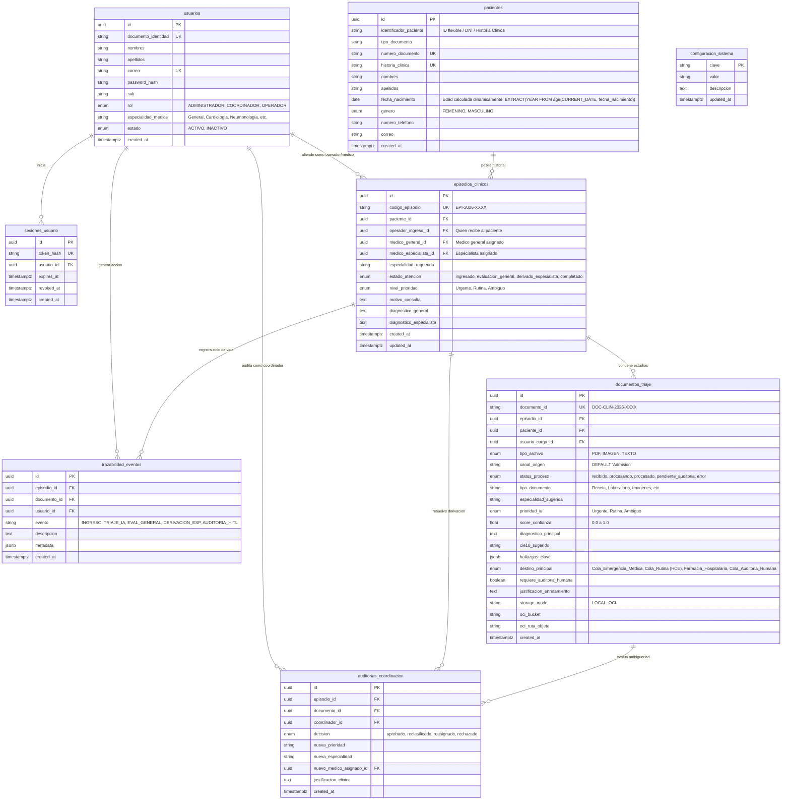

# 🏥 Propuesta de Diseño de Base de Datos y Arquitectura de Módulos — MediFlow

> **Basado en:** Documento Oficial del Proyecto (*Hackathon ONE G10 · Oracle Next Education & Alura*)  
> **Estado:** ✅ **Aprobada e Implementada** (Con observaciones y refinamientos del equipo clínico incorporados).

---

## 🎯 1. Fundamentos del Requerimiento y Respuestas a Observaciones

De acuerdo con el documento oficial del proyecto `Documento-Proyecto-Mediflow.pdf` y las directrices acordadas con el equipo:

1. **Pantalla designada para Human in the Loop (HITL) — Resuelta (Duda 1):**
   - El acceso a la pantalla de **Auditoría Clínica / Human-in-the-Loop** (`/auditoria`) está reservado exclusivamente para los roles **`COORDINADOR`** y **`ADMINISTRADOR`**.
   - Funciona como una bandeja operativa especializada (similar al historial, pero con filtros de ambigüedad, semáforo de confianza < 0.5 y acciones clínicas de aprobación, reclasificación o reasignación médica).

2. **Refinamiento de la Ficha de Pacientes — Resuelto (Duda 2):**
   - **Remoción de columna estática `edad`:** Se elimina el almacenamiento físico estático de la edad. Ahora la edad se calcula **dinámicamente en tiempo real** en base a la `fecha_nacimiento` (`EXTRACT(YEAR FROM age(CURRENT_DATE, fecha_nacimiento))` en PostgreSQL y dinámico en la API). Esto evita endpoints de actualización anual o tareas cron de mantenimiento.
   - **Género con opciones directas:** Se adopta el ENUM clínico `'FEMENINO'` y `'MASCULINO'`.
   - **Contacto estandarizado:** Se estandariza como **`numero_telefono`**.

3. **Ingesta y Destinos Clínicos — Resuelto (Duda 3):**
   - **Canal de origen:** En el flujo de la UI, todo documento ingresado por el operador proviene del punto de entrada institucional, estableciéndose por defecto como `'Admision'` (`DEFAULT 'Admision'`).
   - **Destinos principales ampliados:** Se clarifican e incorporan los destinos hospitalarios clave:
     - 🚨 **`Cola_Emergencia_Medica`**: Atención inmediata y shock trauma para hallazgos críticos (ej. TEP Agudo, infarto).
     - 📁 **`Cola_Rutina`**: Enrutamiento directo a la **Historia Clínica Electrónica (HCE)** y atención en consulta regular.
     - 💊 **`Farmacia_Hospitalaria`**: Validación y dispensación de prescripciones farmacológicas.
     - ⚖️ **`Cola_Auditoria_Humana` / `Cola_Revision_Ambigua`**: Supervisión y resolución por parte del Coordinador Médico (HITL).

4. **Registro de Usuarios y Especialidad Médica:**
   - Roles del sistema unificados:
     - 🛡️ **`ADMINISTRADOR`**: Control total del sistema, gestión de usuarios, auditoría global y configuración técnica (OCI vs LOCAL).
     - 🩺 **`COORDINADOR`**: Supervisión clínica, resolución de ambigüedades (*Human-in-the-Loop*), autorización de interconsultas y asignación a especialistas.
     - 📋 **`OPERADOR`**: Personal de admisión / primer contacto y profesionales que realizan la atención general y carga documental.
   - Se incorpora formalmente la columna **`especialidad_medica`** en la tabla de usuarios (`usuarios`) para reflejar la competencia clínica (`'Medicina General'`, `'Cardiología'`, `'Neumonología'`, etc.).

---

## 📐 2. Diagrama Entidad-Relación (Mermaid ERD)



---

## 🗄️ 3. Diccionario de Datos Detallado

### 3.1. 👤 Tabla `usuarios`
Registra el personal que opera el sistema con soporte de especialidad médica y control de roles unificados.

| Columna | Tipo SQL | Restricciones | Propósito |
| :--- | :--- | :--- | :--- |
| `id` | `UUID` | `PK`, `DEFAULT gen_random_uuid()` | Identificador universal único. |
| `documento_identidad`| `VARCHAR(20)` | `UNIQUE`, `NOT NULL` | Documento de identidad de acceso. |
| `nombres` | `VARCHAR(100)` | `NOT NULL` | Nombres del usuario. |
| `apellidos` | `VARCHAR(100)` | `NOT NULL` | Apellidos del usuario. |
| `correo` | `VARCHAR(255)` | `UNIQUE`, `NULL` | Correo electrónico de contacto o acceso. |
| `password_hash` | `VARCHAR(255)` | `NOT NULL` | Hash PBKDF2-HMAC-SHA256 con salt. |
| `salt` | `VARCHAR(64)` | `NOT NULL` | Salt criptográfico de 32 bytes hex. |
| `rol` | `VARCHAR(50)` | `NOT NULL` | Rol: `'ADMINISTRADOR'`, `'COORDINADOR'`, `'OPERADOR'`. |
| `especialidad_medica`| `VARCHAR(100)`| `NULL` | `'Medicina General'`, `'Cardiología'`, `'Neumonología'`, etc. |
| `estado` | `VARCHAR(20)` | `DEFAULT 'ACTIVO'` | Estado operacional (`'ACTIVO'`, `'INACTIVO'`). |
| `created_at` | `TIMESTAMPTZ` | `DEFAULT NOW()` | Fecha de registro. |
| `updated_at` | `TIMESTAMPTZ` | `DEFAULT NOW()` | Fecha de última actualización. |

---

### 3.2. 🩺 Tabla `pacientes`
Ficha clínica de paciente sin columna estática redundante de edad: la edad es dinámica y se calcula a partir de `fecha_nacimiento`.

| Columna | Tipo SQL | Restricciones | Propósito |
| :--- | :--- | :--- | :--- |
| `id` | `UUID` | `PK`, `DEFAULT gen_random_uuid()` | Identificador único de paciente. |
| `tipo_documento` | `VARCHAR(20)` | `DEFAULT 'DNI'` | Tipo de documento (`'DNI'`, `'CE'`, `'PASAPORTE'`). |
| `numero_documento` | `VARCHAR(50)` | `UNIQUE`, `NOT NULL` | Identificador internacional / DNI / Pasaporte. |
| `historia_clinica` | `VARCHAR(50)` | `UNIQUE`, `NULL` | Número de historia clínica electrónica única. |
| `nombres` | `VARCHAR(150)` | `NOT NULL` | Nombres del paciente. |
| `apellidos` | `VARCHAR(150)` | `NOT NULL` | Apellidos del paciente. |
| `fecha_nacimiento` | `DATE` | `NULL` | Fecha de nacimiento (calcula `edad` en tiempo real). |
| `genero` | `VARCHAR(20)` | `CHECK IN ('FEMENINO', 'MASCULINO')` | Opciones de género estándar. |
| `numero_telefono` | `VARCHAR(50)` | `NULL` | Número telefónico principal de contacto. |
| `correo` | `VARCHAR(250)` | `NULL` | Correo electrónico de contacto. |
| `created_at` | `TIMESTAMPTZ` | `DEFAULT NOW()` | Fecha de creación de ficha. |
| `updated_at` | `TIMESTAMPTZ` | `DEFAULT NOW()` | Fecha de última actualización. |

> 💡 **Cálculo dinámico de edad en SQL:**
> ```sql
> SELECT id, nombres, apellidos, fecha_nacimiento,
>        EXTRACT(YEAR FROM age(CURRENT_DATE, fecha_nacimiento))::INT AS edad
> FROM pacientes;
> ```

---

### 3.3. 🔄 Tabla `episodios_clinicos` (Flujo de Atención Escalable)
Modela el ciclo de vida real: **Admisión ➔ Médico General ➔ Médico Especialista**, con trazabilidad de derivaciones.

| Columna | Tipo SQL | Restricciones | Propósito |
| :--- | :--- | :--- | :--- |
| `id` | `UUID` | `PK`, `DEFAULT gen_random_uuid()` | Identificador de atención. |
| `codigo_episodio` | `VARCHAR(50)` | `UNIQUE`, `NOT NULL` | Código de seguimiento (ej: `EPI-2026-0045`). |
| `paciente_id` | `UUID` | `FK -> pacientes(id)` | Paciente atendido. |
| `operador_ingreso_id`| `UUID` | `FK -> usuarios(id)` | Usuario de admisión que abrió la atención. |
| `medico_general_id` | `UUID` | `FK -> usuarios(id)`, `NULL` | Médico general que realizó la primera evaluación. |
| `medico_especialista_id`| `UUID` | `FK -> usuarios(id)`, `NULL` | Especialista asignado en caso de derivación. |
| `especialidad_requerida`| `VARCHAR(100)`| `NULL` | Especialidad médica solicitada. |
| `estado_atencion` | `VARCHAR(50)` | `DEFAULT 'ingresado'` | Estados: `'ingresado'`, `'evaluacion_general'`, `'derivado_especialista'`, `'en_atencion_especialista'`, `'auditoria_coordinacion'`, `'completado'`. |
| `nivel_prioridad` | `VARCHAR(20)` | `DEFAULT 'Rutina'` | Prioridad clínica (`Urgente`, `Rutina`, `Ambiguo`). |
| `motivo_consulta` | `TEXT` | `NULL` | Motivo de ingreso reportado. |
| `diagnostico_general` | `TEXT` | `NULL` | Conclusión médica de la atención general. |
| `diagnostico_especialista`| `TEXT` | `NULL` | Conclusión e indicación del especialista. |
| `created_at` | `TIMESTAMPTZ` | `DEFAULT NOW()` | Fecha de apertura. |
| `updated_at` | `TIMESTAMPTZ` | `DEFAULT NOW()` | Última actualización. |

---

### 3.4. 📄 Tabla `documentos_triaje` (Integración con LangGraph, LLM y OCI)
Almacena los documentos clínicos procesados por el Agente Autónomo MediFlow según el documento de evaluación del Hackathon.

| Columna | Tipo SQL | Restricciones | Propósito |
| :--- | :--- | :--- | :--- |
| `id` | `UUID` | `PK`, `DEFAULT gen_random_uuid()` | ID interno del registro. |
| `documento_id` | `VARCHAR(100)` | `UNIQUE`, `NOT NULL` | ID comercial/clínico (`DOC-CLIN-2026-8942`). |
| `episodio_id` | `UUID` | `FK -> episodios_clinicos(id)` | Episodio de atención vinculado. |
| `paciente_id` | `UUID` | `FK -> pacientes(id)` | Paciente asociado en el sistema. |
| `usuario_carga_id` | `UUID` | `FK -> usuarios(id)` | Usuario que subió el documento. |
| `tipo_archivo` | `VARCHAR(20)` | `NOT NULL` | `'PDF'`, `'IMAGEN'`, `'TEXTO'`. |
| `canal_origen` | `VARCHAR(100)` | `DEFAULT 'Admision'` | Canal emisor (por defecto `'Admision'`). |
| `texto_extraido` | `TEXT` | `NULL` | Texto extraído por PyMuPDF o Tesseract OCR. |
| `tipo_documento` | `VARCHAR(100)` | `NULL` | Receta Médica, Informe de Laboratorio, etc. |
| `especialidad_sugerida`| `VARCHAR(100)`| `NULL` | Especialidad inferida por el agente IA. |
| `prioridad_ia` | `VARCHAR(20)` | `NOT NULL` | `'Urgente'`, `'Rutina'`, `'Ambiguo'`. |
| `score_confianza` | `NUMERIC(4,3)` | `CHECK (>= 0 AND <= 1)` | Puntuación de confianza (0.000 a 1.000). |
| `diagnostico_principal`| `TEXT` | `NULL` | Hipótesis clínica extraída por el LLM. |
| `cie10_sugerido` | `VARCHAR(20)` | `NULL` | Código CIE-10 propuesto. |
| `hallazgos_clave` | `JSONB` | `DEFAULT '[]'` | Lista estructurada de hallazgos críticos. |
| `destino_principal` | `VARCHAR(50)` | `NOT NULL` | `'Cola_Emergencia_Medica'`, `'Cola_Rutina'`, `'Farmacia_Hospitalaria'`, `'Cola_Auditoria_Humana'`. |
| `requiere_auditoria_humana`| `BOOLEAN` | `DEFAULT FALSE` | `true` si score < 0.5 o ambiguo. |
| `storage_mode` | `VARCHAR(10)` | `DEFAULT 'LOCAL'` | Modo físico: `'LOCAL'` u `'OCI'`. |
| `oci_bucket` | `VARCHAR(100)` | `NULL` | Bucket de OCI Object Storage. |
| `oci_ruta_objeto` | `VARCHAR(255)` | `NULL` | Ruta en el Object Storage. |
| `created_at` | `TIMESTAMPTZ` | `DEFAULT NOW()` | Fecha de procesamiento. |

---

### 3.5. ⚖️ Tabla `auditorias_coordinacion` (Human-in-the-Loop)
Registra las decisiones tomadas por el **Coordinador** cuando el documento es ambiguo o una derivación requiere revisión.

| Columna | Tipo SQL | Restricciones | Propósito |
| :--- | :--- | :--- | :--- |
| `id` | `UUID` | `PK`, `DEFAULT gen_random_uuid()` | Identificador de auditoría. |
| `episodio_id` | `UUID` | `FK -> episodios_clinicos(id)` | Episodio auditado. |
| `documento_id` | `UUID` | `FK -> documentos_triaje(id)` | Documento sujeto a revisión. |
| `coordinador_id` | `UUID` | `FK -> usuarios(id)` | Usuario coordinador que emite el dictamen. |
| `decision` | `VARCHAR(30)` | `NOT NULL` | `'aprobado'`, `'reclasificado'`, `'reasignado'`, `'rechazado'`. |
| `nueva_prioridad` | `VARCHAR(20)` | `NULL` | Corrección humana de prioridad. |
| `nueva_especialidad` | `VARCHAR(100)`| `NULL` | Corrección de especialidad clínica. |
| `nuevo_medico_asignado_id`| `UUID` | `FK -> usuarios(id)`, `NULL` | Reasignación manual de profesional. |
| `justificacion_clinica`| `TEXT` | `NOT NULL` | Fundamentación médica obligatoria de la decisión. |
| `created_at` | `TIMESTAMPTZ` | `DEFAULT NOW()` | Fecha de registro del dictamen. |

---

### 3.6. 📜 Tabla `trazabilidad_eventos`
Bitácora inmutable de eventos para auditoría de cumplimiento hospitalario.

| Columna | Tipo SQL | Restricciones | Propósito |
| :--- | :--- | :--- | :--- |
| `id` | `UUID` | `PK`, `DEFAULT gen_random_uuid()` | ID de evento. |
| `episodio_id` | `UUID` | `FK -> episodios_clinicos(id)` | Episodio asociado (si aplica). |
| `documento_id` | `UUID` | `FK -> documentos_triaje(id)` | Documento asociado (si aplica). |
| `usuario_id` | `UUID` | `FK -> usuarios(id)`, `NULL` | Usuario que ejecutó la acción. |
| `evento` | `VARCHAR(50)` | `NOT NULL` | Código de evento (`INGRESO`, `TRIAJE_IA`, `EVAL_GENERAL`, `DERIVACION_ESP`, `AUDITORIA_HITL`). |
| `descripcion` | `TEXT` | `NOT NULL` | Explicación legible del evento. |
| `metadata` | `JSONB` | `DEFAULT '{}'` | Instantánea de datos complementarios. |
| `created_at` | `TIMESTAMPTZ` | `DEFAULT NOW()` | Timestamp de ocurrencia. |

---

### 3.7. ⚙️ Tablas de Soporte (`configuracion_sistema` y `sesiones_usuario`)
- **`configuracion_sistema`**: Almacena `modo_almacenamiento` (`LOCAL` u `OCI`), umbrales de score (`CONFIDENCE_HIGH = 0.8`, `CONFIDENCE_LOW = 0.5`).
- **`sesiones_usuario`**: Almacena tokens de sesión revocables (`Bearer mf_session_...`) vinculados a `usuarios(id)`.

---

## 🏛️ 4. Matriz de los 5 Módulos y Control de Acceso por Roles (RBAC)

El sistema se estructura en **5 módulos funcionales**, con acceso restringido de forma estricta según el rol:

| # | Módulo | Descripción Funcional | `OPERADOR` | `COORDINADOR` | `ADMINISTRADOR` |
| :-: | :--- | :--- | :---: | :---: | :---: |
| **1** | **Admisión & Triaje Documental IA** | Registro de pacientes, ingesta multimodal de documentos (PDF/Imagen/Texto, canal por defecto `'Admision'`), ejecución de LangGraph y score preliminar. | ✅ **Acceso Total** | 👁️ Solo Lectura | ✅ **Acceso Total** |
| **2** | **Atención Médica General** | Evaluación de primer contacto, correlación diagnóstica con la hipótesis del LLM, emisión de receta/indicación general o solicitud formal de interconsulta especializada. | ✅ **Acceso Total** | 👁️ Solo Lectura | ✅ **Acceso Total** |
| **3** | **Atención Médica Especializada** | Cola de derivaciones por especialidad (Cardiología, Neumonología, etc.). Recepción de alertas urgentes (ej. TEP Agudo), diagnóstico avanzado y alta clínica. | ✅ Solo asignados | ✅ **Gestión & Reasignación** | ✅ **Acceso Total** |
| **4** | **Auditoría Clínica & HITL** | Bandeja designada de casos ambiguos o con confianza < 0.5. El coordinador resuelve ambigüedades, corrige clasificaciones del LLM y aprueba derivaciones dudosas. | ❌ Sin Acceso | ✅ **Acceso Total** | ✅ **Acceso Total** |
| **5** | **Gestión, Trazabilidad & Configuración** | Alta de usuarios con especialidad médica, cambio de modo de persistencia (LOCAL/OCI) y visor de eventos inmutables. | ❌ Sin Acceso | ❌ Sin Acceso | ✅ **Acceso Exclusivo** |

---

## 🔄 5. Flujo Operativo Completo (Paso a Paso)

```
[Paciente Llega a Admisión / Se Recibe Documento]
               │
               ▼
[Módulo 1: Admisión & Ingestión (OPERADOR / Admisión)]
   • Registra Paciente (DNI/HC, Nombres, Apellidos, Teléfono, Fecha Nacimiento)
   • Ingesta Documento (PDF/Imagen/Texto, Canal: 'Admision')
   • LangGraph ejecuta Triaje Inteligente:
         ├── Score ≥ 0.8 & Urgente  ➔ Prioridad ALTA  ➔ Cola Médica Urgente (Shock Trauma)
         ├── Score ≥ 0.8 & Rutina   ➔ Prioridad NORMAL➔ Cola Rutina (Historia Clínica Electrónica)
         ├── Receta Validada        ➔ Farmacia        ➔ Farmacia Hospitalaria
         └── Score < 0.5 o Ambiguo  ➔ Requiere HITL   ➔ [Módulo 4: Coordinador Médico]
               │
               ▼
[Módulo 2: Atención Médica General (Médico General / Operador)]
   • Revisa Documento + Extracción del LLM (CIE-10 sugerido, hallazgos)
   • ¿El cuadro requiere especialista?
         ├── NO ➔ Resuelve en Consulta General ➔ Estado: COMPLETADO
         └── SÍ ➔ Genera Derivación Especializada (Episodio Clínico)
               │
               ▼
[Módulo 3: Atención Especializada (Médico Especialista según su Especialidad)]
   • Especialista asignado atiende el caso (ej: Neumólogo por TEP agudo)
   • Registra evolución final y estudios ➔ Estado: COMPLETADO
               │
               ▲ (En cualquier punto si hay conflicto/ambigüedad)
               │
[Módulo 4: Coordinación & Auditoría (COORDINADOR)]
   • Bandeja designada Human-in-the-Loop (/auditoria)
   • Resuelve incongruencias del LLM
   • Reasigna profesional o reclasifica urgencia
```

---

## 📋 Resumen de Implementación

1. **Migraciones:** Nueva migración Alembic `o8p808522kl4_implement_unified_db_proposal` y script SQL `V002__unified_proposal_schema.sql` aplicados.
2. **Tablas nuevas y ampliadas:** `episodios_clinicos`, `auditorias_coordinacion`, `trazabilidad_eventos`, con `especialidad_medica` en `usuarios`, `Farmacia_Hospitalaria` en `destino_enum`, y edad calculada dinámicamente en `pacientes`.
3. **Contenedor Docker:** Imagen del backend nombrada como el proyecto: `image: mediflow:latest`.

