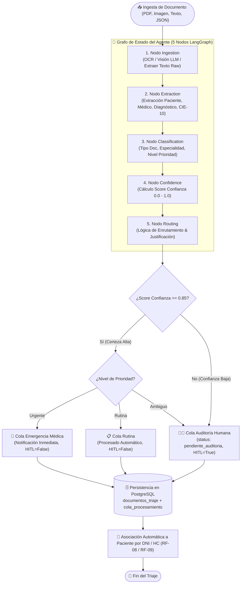
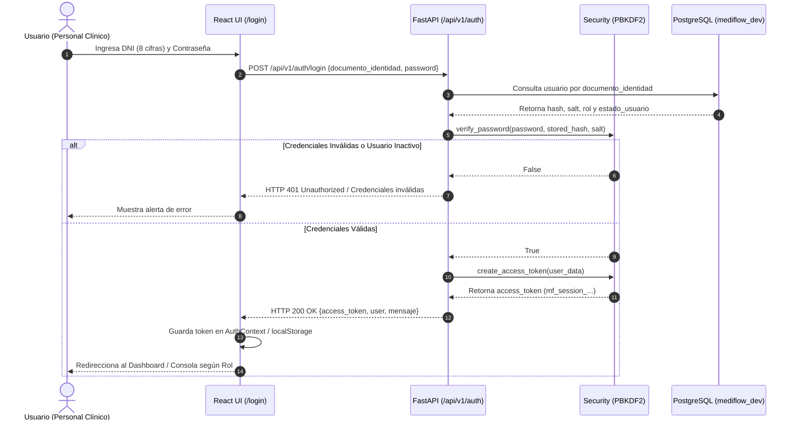
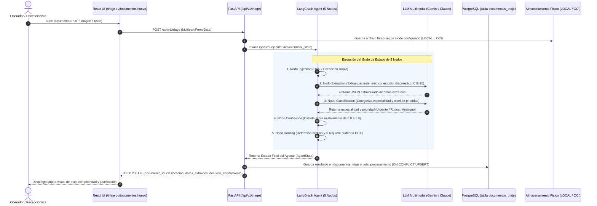
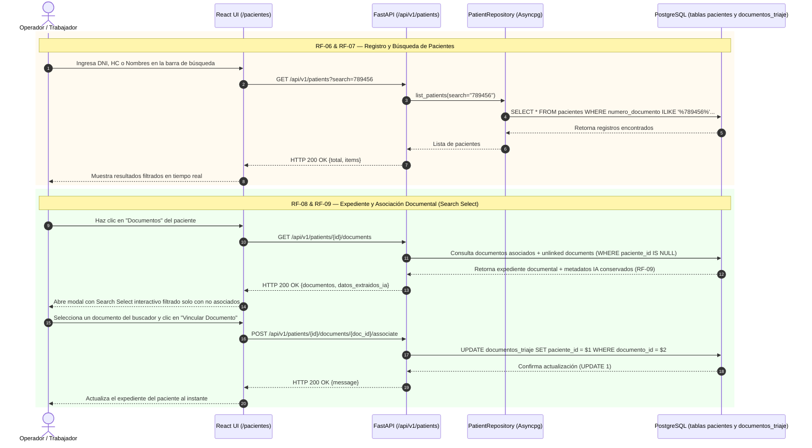
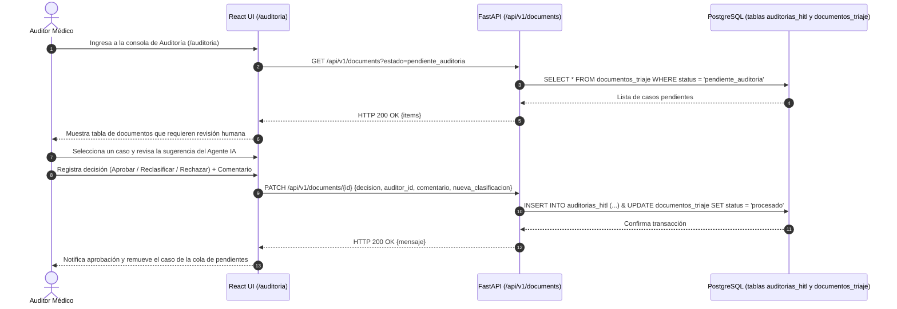
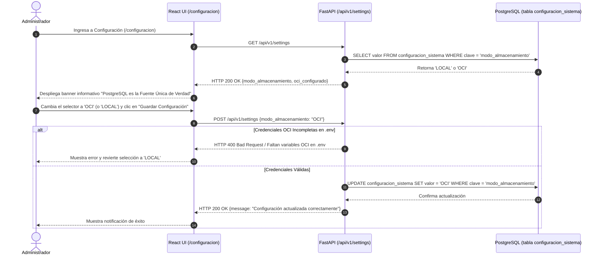

# 🏥 MediFlow — Resumen Arquitectónico y Flujos de Triaje del Sistema

Este documento proporciona la especificación completa, diagramas de secuencia y flujos de trabajo detallados de **todos los procesos de negocio, técnicos y clínicos de Triaje Autónomo** que componen el sistema **MediFlow (Agente Autónomo de Triaje Clínico Multimodal)** (RF-01 al RF-20).

---

## 📌 1. Mapa Global del Agente Autónomo de Triaje (LangGraph)

---

## 🔬 2. Detalle Profundo Nodo por Nodo del Grafo de Triaje

### 1️⃣ Nodo 1: `ingestion` (Normalización y Visión Multimodal)
- **Entrada**: Archivo subido (PDF, Imagen PNG/JPG, Texto plano, o JSON) y `canal_origen`.
- **Lógica**:
  - Si es texto plano o JSON, extrae directamente la cadena de caracteres.
  - Si es PDF o Imagen, ejecuta el módulo de visión multimodal (Gemini / Claude OCR) para convertir el documento clínico manuscrito o escaneado en `texto_extraido`.
- **Salida en AgentState**: `texto_extraido`, `nodos_ejecutados = ["ingestion"]`.

### 2️⃣ Nodo 2: `extraction` (Extracción de Entidades Médicas & CIE-10)
- **Entrada**: `texto_extraido`.
- **Lógica Prompt Médica**: El LLM analiza el texto clínico y genera un JSON Pydantic estructurado:
  - `paciente`: `{nombre, edad, id_externo (DNI/HC)}`.
  - `medico_solicitante`: `{nombre, matricula}`.
  - `estudio_realizado`: Descripción del análisis o prueba.
  - `diagnostico_principal`: Hallazgo patológico o motivo de consulta.
  - `cie10_sugerido`: Código estándar de clasificación internacional de enfermedades (ej. `D64.9 Anemia`, `J18.9 Neumonía`, `Z01.8`).
  - `hallazgos_clave`: Lista de observaciones o constantes vitales alteradas.
- **Salida en AgentState**: `datos_extraidos`, `nodos_ejecutados = ["ingestion", "extraction"]`.

### 3️⃣ Nodo 3: `classification` (Especialidad y Prioridad Clínica)
- **Entrada**: `datos_extraidos` y `texto_extraido`.
- **Lógica de Clasificación**:
  - `tipo_documento`: Receta Médica, Informe de Laboratorio, Radiografía/Imagen, Epicrisis, Carta de Derivación.
  - `especialidad`: Cardiología, Neumología, Hematología, Medicina General, Traumatología, etc.
  - `nivel_prioridad`:
    - **`Urgente`**: Valores críticos de laboratorio, riesgo vital, infartos, neumonías graves, hemorragias o alteraciones severas.
    - **`Rutina`**: Controles periódicos, recetas estándar, análisis de seguimiento normal.
    - **`Ambiguo`**: Múltiples diagnósticos contradictorios, falta de datos críticos o texto parcialmente ilegible.
- **Salida en AgentState**: `clasificacion`, `nodos_ejecutados = ["ingestion", "extraction", "classification"]`.

### 4️⃣ Nodo 4: `confidence` (Score Multivariante de Confianza)
- **Entrada**: `clasificacion` y `datos_extraidos`.
- **Algoritmo de Scoring**: Evalúa 4 factores ponderados:
  $$\text{Score} = 0.35 \cdot C_{\text{paciente}} + 0.25 \cdot C_{\text{diagnostico}} + 0.20 \cdot C_{\text{cie10}} + 0.20 \cdot C_{\text{claridad}}$$
  - Si faltan datos clave (ej. sin diagnóstico o sin paciente), el score penaliza por debajo de `0.70`.
  - Si todos los campos son coherentes y claros, el score alcanza valores entre `0.85` y `1.00`.
- **Salida en AgentState**: `score_confianza_clasificacion`, `nodos_ejecutados = ["ingestion", "extraction", "classification", "confidence"]`.

### 5️⃣ Nodo 5: `routing` (Enrutamiento Autónomo & Justificación)
- **Entrada**: Estado consolidado del agente.
- **Matriz de Reglas de Enrutamiento**:

| Nivel de Prioridad | Score de Confianza | Destino Principal | Requiere Auditoría Humana (`HITL`) | Estado del Documento |
| :--- | :--- | :--- | :--- | :--- |
| **Urgente** | $\ge 0.85$ | `Cola_Emergencia_Medica` | `False` | `procesado` (Notificación Urgente) |
| **Rutina** | $\ge 0.85$ | `Cola_Rutina` | `False` | `procesado` |
| **Ambiguo** | Cualquier Score | `Cola_Auditoria_Humana` | `True` | `pendiente_auditoria` |
| Cualquier Prioridad | $< 0.85$ | `Cola_Auditoria_Humana` | `True` | `pendiente_auditoria` |

- **Salida en AgentState**: `decision_enrutamiento` con `destino_principal`, `requiere_auditoria_humana`, `justificacion_enrutamiento` y `notificacion_generada`.

---

## 🔄 3. Diagramas de Secuencia Detallados por Flujo

### 🔐 Flujo A: Autenticación, Login y Control de Acceso RBAC (RF-01 al RF-05)

---

### 📥 Flujo B: Ingesta Multicanal y Triaje Autónomo en LangGraph (RF-10 al RF-13)

---

### 👤 Flujo C: Registro, Búsqueda y Asociación de Pacientes (RF-06 al RF-09)

---

### 🩺 Flujo D: Auditoría Médica e Intervención Humana (HITL) (RF-14)

---

### ⚙️ Flujo E: Configuración del Modo de Almacenamiento Dual (RF-15 al RF-17)

---

## 📋 Resumen Sintético de Módulos y Flujos

| Módulo | Nombre del Módulo | Requerimientos | Principales Entidades / Tablas | Componentes Frontend Clave |
| :--- | :--- | :--- | :--- | :--- |
| **Módulo 1** | Autenticación y RBAC | RF-01 al RF-05 | `usuarios`, `rol_enum`, `estado_usuario_enum` | `/login`, `/usuarios` (`UsersManagementView.tsx`) |
| **Módulo 2** | Pacientes y Expedientes | RF-06 al RF-09 | `pacientes`, `documentos_triaje.paciente_id` | `/pacientes` (`PatientsManagementView.tsx` + `SearchableDocSelect`) |
| **Módulo 3** | Ingesta y Triaje LangGraph | RF-10 al RF-13 | `documentos_triaje`, `cola_procesamiento` | `/triaje` (`TriageConsoleView.tsx`), `/documentos/nuevo` |
| **Módulo 4** | Auditoría Médica HITL | RF-14 | `auditorias_hitl` | `/auditoria` (`Audit.tsx`), `/auditoria/:id` (`AuditDetail.tsx`) |
| **Módulo 5** | Configuración & Almacenamiento | RF-15 al RF-17 | `configuracion_sistema` | `/configuracion` (`StorageSettingsView.tsx`) |
| **Módulo 6** | Dashboard y Documentación | RF-18 al RF-20 | `documentos_triaje`, `notificaciones` | `/dashboard` (`Dashboard.tsx`), `/documentos`, `/documentacion` |
