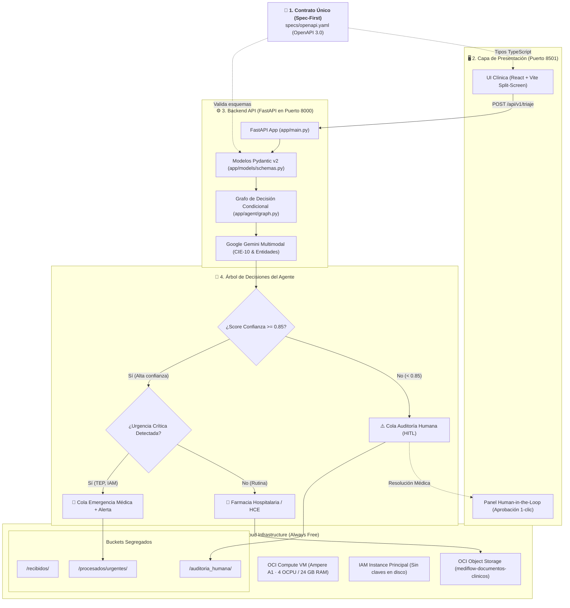

# 🏥 MediFlow — Agente Autónomo para Triaje, Extracción y Enrutamiento Clínico

> **Programa ONE · Grupo 10** | Oracle Next Education & Alura  
> **Proyecto 2 — Hackathon ONE G10**  
> *Metodología:* Spec-First / Schema-Driven Development (SDD)  
> *Infraestructura:* Oracle Cloud Infrastructure (OCI Always Free) · Google Gemini · FastAPI · LangGraph

---


---

## 📌 Resumen Ejecutivo

En el sector **HealthTech** y la gestión hospitalaria, miles de horas se pierden diariamente en la lectura y transcripción manual de recetas médicas, informes radiológicos y órdenes de estudio. Este cuello de botella no solo genera costosos débitos administrativos, sino que provoca demoras críticas en la atención de pacientes con riesgo vital.

**MediFlow** es un agente inteligente y autónomo que ingesta documentos clínicos heterogéneos (PDFs escaneados, imágenes o texto), extrae entidades médicas esenciales con códigos **CIE-10** mediante modelos multimodales (**Google Gemini**), evalúa la gravedad y el score de confianza en un **grafo de decisión condicional**, y enruta automáticamente los resultados hacia su destino correspondiente, persistiendo la pista de auditoría en **OCI Object Storage (Capa Always Free)** con soporte de **Human-in-the-Loop (HITL)** para casos ambiguos.

---

## 🏛️ Arquitectura del Sistema y Metodología SDD

El proyecto está diseñado bajo la metodología **Spec-First / Schema-Driven Development (SDD)**: el contrato formal en OpenAPI 3.0 ([`specs/openapi.yaml`](specs/openapi.yaml)) es la **única fuente de la verdad** que rige las validaciones de backend, los tipos en el frontend y las pruebas automatizadas.



---

## 🛠️ Stack Tecnológico

| Capa / Componente | Tecnología | Rol y Propósito en el Sistema |
|:---|:---|:---|
| **Contratos & Especificación** | **OpenAPI 3.0 + JSON Schema** | Metodología Spec-First ([`specs/openapi.yaml`](specs/openapi.yaml)) como única fuente de la verdad. |
| **Backend API** | **FastAPI + Pydantic v2** | Microservicio REST asíncrono con validación estricta de esquemas clínicos. |
| **IA & LLM Multimodal** | **Google Gemini 1.5** | Extracción de entidades médicas, codificación CIE-10 y OCR de documentos clínicos. |
| **Orquestación del Agente** | **LangGraph + n8n** | Grafo de decisión condicional determinista y automatización de alertas hospitalarias. |
| **Capa de Presentación (UI)** | **React 18 + Vite (TypeScript)** | Visualizador Split-Screen y panel Human-in-the-Loop (HITL) con aprobación médica en 1-clic. |
| **Cloud Storage** | **OCI Object Storage** | Persistencia segregada en 3 buckets (`/recibidos`, `/procesados`, `/auditoria_humana`). |
| **Cloud Compute** | **OCI Compute Ampere A1** | Máquina virtual Always Free (4 OCPUs / 24 GB RAM) con arquitectura Stateless Compute. |
| **Seguridad Cloud** | **OCI IAM Instance Principal** | Autenticación nativa por identidad de instancia, sin almacenar claves ni credenciales en disco. |
| **DevOps & CI/CD** | **Docker Compose + GitHub Actions** | Orquestación de servicios multicontenedor y pruebas de contrato automatizadas en cada PR. |

---

Cumpliendo estrictamente con el pliego y la política social del programa ONE, la solución opera 100% en la capa **Always Free** de Oracle Cloud:

* **OCI Compute Instance (Ampere A1 ARM64):** 4 OCPUs y **24 GB de memoria RAM** ejecutando los servicios en contenedores Docker.
* **Seguridad de Nivel Empresarial con `Instance Principal`:** El backend se autentica contra OCI mediante la identidad de la propia máquina virtual (Dynamic Group en IAM), **sin almacenar contraseñas ni archivos de llaves privadas en disco**.
* **Arquitectura Sin Estado (*Stateless Compute*):** El estado real vive en OCI Object Storage; la máquina virtual es completamente descartable y replicable.
* **OCI Object Storage Segregado:**
  * `mediflow-documentos-clinicos/recibidos/`: Archivos originales entrantes (PDF / imagen / texto).
  * `mediflow-documentos-clinicos/procesados/urgentes/`: Informes críticos con notificación despachada.
  * `mediflow-documentos-clinicos/procesados/farmacia/`: Recetas validadas derivadas a dispensación.
  * `mediflow-documentos-clinicos/auditoria_humana/`: Casos aislados para visto bueno médico.

---

## 🧪 Los 3 Escenarios Clínicos de Prueba (Demostrables)

El sistema incluye datasets clínicos en `datasets/` para validar los 3 flujos exigidos en la hackathon:

| # | Escenario Clínico | Archivo de Entrada | Diagnóstico & CIE-10 | Score | Decisión de Enrutamiento | Destino en OCI |
|---|---|---|---|:---:|---|---|
| **1** | **Flujo Estándar** | [`datasets/caso_1_estandar_receta.json`](datasets/caso_1_estandar_receta.json) | Hipertensión Arterial (`I10`) | `0.95` | `Farmacia_Hospitalaria` | `/procesados/farmacia/` |
| **2** | **Urgencia Médica Crítica** | [`datasets/caso_2_urgencia_tep.json`](datasets/caso_2_urgencia_tep.json) | Tromboembolismo Pulmonar (`I26.9`) | `0.99` | `Cola_Emergencia_Medica` + Alerta | `/procesados/urgentes/` |
| **3** | **Ambigüedad (HITL)** | [`datasets/caso_3_ambiguo_hitl.json`](datasets/caso_3_ambiguo_hitl.json) | Borroso / Ilegible | `< 0.85` | `Cola_Auditoria_Humana` | `/auditoria_humana/` |

---

## 🚀 Inicio Rápido (Quickstart Local)

### Prerrequisitos
* [Docker Desktop](https://www.docker.com/) y Docker Compose instalados.
* Python 3.11+ (opcional para desarrollo local sin Docker).

### 1. Clonar el repositorio
```bash
git clone https://github.com/No-Country-simulation/G10-LATAM-TEAM-02-MediFlowI-Agente-IA.git
cd G10-LATAM-TEAM-02-MediFlowI-Agente-IA
```

### 2. Configurar variables de entorno
```bash
cp .env.example .env
# Completa tu GEMINI_API_KEY en el archivo .env
```

### 3. Levantar los servicios con Docker Compose
```bash
docker compose up -d
```
Los servicios estarán disponibles inmediatamente en:
* 🩺 **Backend API & Swagger UI:** [`http://localhost:8000/docs`](http://localhost:8000/docs)
* 📊 **Health Check:** [`http://localhost:8000/health`](http://localhost:8000/health)
* 🖥️ **UI Clínica (React + Vite):** [`http://localhost:8501`](http://localhost:8501)
* ⚡ **Orquestador de Alertas (n8n):** [`http://localhost:5678`](http://localhost:5678)

### 4. Ejecutar las Pruebas de Contrato Automatizadas
```bash
python3 -m pytest backend-api/tests/ -v
```

---

## 📁 Estructura del Repositorio

```text
mediflow/
├── specs/
│   └── openapi.yaml               # Contrato formal OpenAPI 3.0 (Fuente de la verdad)
├── backend-api/                   # Microservicio Backend (FastAPI + LangGraph)
│   ├── app/
│   │   ├── main.py                # Endpoints REST (/triaje, /health, /auditoria, /metricas)
│   │   ├── models/schemas.py      # Modelos Pydantic v2 alineados a la spec
│   │   ├── agent/graph.py         # Grafo de decisión y bifurcaciones condicionales
│   │   └── services/oci.py        # Conector OCI SDK con Instance Principal & Mock
│   └── tests/
│       └── test_contract.py       # Pruebas automatizadas contra la spec (3/3 ✅)
├── frontend/                      # Aplicación Web React 18 + Vite (TypeScript)
│   ├── src/                       # Componentes Split-Screen y panel Human-in-the-Loop
│   └── scripts/generate-api.sh    # Generador de tipos TypeScript desde specs/openapi.yaml
├── datasets/                      # Casos clínicos de prueba (Rutina, TEP, Ambiguo)
├── docs/                          # Documentación maestra de ingeniería
│   ├── backlog.md                 # Backlog unificado (HUs + Tareas atómicas T-01 a T-18)
│   ├── sdd.md                     # Software Design Document (Arquitectura técnica)
│   ├── guia-desarrollo.md         # Manual de desarrollo con snippets de código por tarea
│   ├── design_system.md           # Sistema de diseño UI/UX HealthTech
│   └── workflow.md                # Flujo de Git en 7 pasos, Conventional Commits y SemVer
├── scripts/
│   ├── crear-issues.sh            # Automatización de 18 GitHub Issues vía GitHub CLI (gh)
│   └── validate_schemas.py        # Validador sintáctico de esquemas JSON
├── docker-compose.yml             # Orquestador unificado (API, UI, n8n)
├── requirements.txt               # Dependencias Python globales
└── CONTRIBUTING.md                # Guía de contribución para el equipo
```

---

## 👥 Organización del Equipo (8 Integrantes)

Para coordinar el desarrollo sin bloqueos ni colisiones, el trabajo se gestiona mediante el **[Product Backlog Unificado (`docs/backlog.md`)](docs/backlog.md)**:

| Rol Especializado | Tareas Clave Asignadas |
|---|---|
| **Team Leader / Arquitectura (1)** | `T-01` (Scaffolding), `T-16` (README final), Code Reviews |
| **AI & Prompt Engineers (2)** | `T-05` (Pydantic), `T-06` (Gemini Multimodal + CIE-10) |
| **Workflow & Backend Engineers (2)** | `T-07` (Routing), `T-09` (Docker n8n), `T-10` (Workflow n8n), `T-11` (Alertas) |
| **Cloud & OCI Engineer (1)** | `T-08` (OCI Object Storage SDK), `T-17` (Guía VM Ampere A1) |
| **Frontend / UI Engineer (1)** | `T-12` (Carga/Casos), `T-13` (Visor Split-Screen), `T-14` (Panel HITL) |
| **QA, Datasets & Demo (1)** | `T-02`, `T-03`, `T-04` (Datasets clínicos), `T-15` (Tests), `T-18` (Guión demo) |

> 💡 **Para desarrolladores:** Consulta la [**`docs/guia-desarrollo.md`**](docs/guia-desarrollo.md) para copiar fragmentos de código listos para tu tarea.

---

## 📄 Licencia y Reconocimientos
Proyecto desarrollado con fines académicos y sociales en el marco de la **Hackathon ONE Grupo 10 — Oracle Next Education & Alura Latam**. Uso exclusivo de recursos en la capa **Always Free** de Oracle Cloud Infrastructure.
