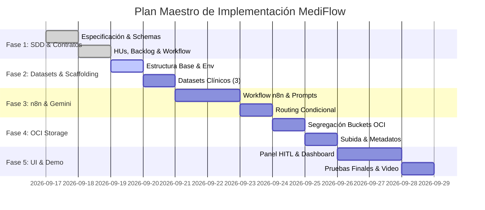

# 🗺️ Plan de Implementación Maestro – MediFlow
**Proyecto:** MediFlow – Hackathon ONE G10  
**Metodología:** Schema-Driven Development (SDD)  
**Versión:** 1.0.0  

---

## 1. Fases del Proyecto y Cronograma de Entregas

---

## 2. Detalle de Fases y Entregables

### 🏁 Fase 1: Especificación, Metodología SDD y Contratos (100% Completada)
* **Objetivo:** Definir la verdad única del sistema antes de codificar.
* **Entregables:**
  * [`docs/sdd.md`](sdd.md): Arquitectura integral, grafo de decisiones y diseño técnico.
  * [`schemas/`](../schemas/): Contratos formales de entrada, extracción LLM y salida de triaje.
  * [`docs/backlog.md`](backlog.md): Requerimientos y HUs unificadas con criterios de aceptación Gherkin y tareas técnicas atómicas.
  * [`docs/workflow.md`](workflow.md) & [`CONTRIBUTING.md`](../CONTRIBUTING.md): Conventional Commits y SemVer.
* **Hito alcanzado:** `v0.1.0`.

---

### 📦 Fase 2: Scaffolding y Datasets Clínicos de Prueba
* **Objetivo:** Levantar el esqueleto del repositorio y construir los casos de prueba deterministas solicitados por el pliego.
* **Entregables:**
  * Estructura de carpetas (`src/`, `datasets/`, `workflows/`, `frontend/`).
  * `.gitignore`, `.env.example` y `requirements.txt`.
  * `datasets/01_caso_estandar_receta.json` (Receta de rutina a Farmacia).
  * `datasets/02_caso_urgencia_tep.json` (Informe de TEP agudo a Emergencias + Alerta).
  * `datasets/03_caso_ambiguo_hitl.json` (Baja confianza a Cola Auditoría Humana).
* **Criterio de Aceptación:** Los 3 datasets validan 100% contra los esquemas de entrada y salida esperados.
* **Hito:** `v0.2.0`.

---

### 🧠 Fase 3: Orquestación en n8n y Agente Multimodal Gemini
* **Objetivo:** Construir el grafo de decisión con nodos de IA y bifurcaciones condicionales.
* **Entregables:**
  * Prompt de sistema clínico de alta fidelidad para Gemini 1.5/2.0 Flash multimodal.
  * Webhook de ingesta en n8n (`POST /api/v1/triaje`).
  * Nodo evaluador de confianza y detección de gravedad.
  * Nodo de bifurcación condicional (`Switch`/`IF`) con enrutamiento automático.
  * Nodo de notificaciones inmediatas para emergencias (Slack/Email/Webhook).
  * Exportación reproducible: `workflows/mediflow_n8n_workflow.json`.
* **Criterio de Aceptación:** El workflow procesa los 3 datasets y produce el JSON de respuesta oficial.

---

### ☁️ Fase 4: Persistencia y Segregación en OCI Object Storage
* **Objetivo:** Cumplir el requisito evaluable obligatorio de Oracle Cloud Infrastructure (Always Free).
* **Entregables:**
  * Script/conector de OCI Object Storage usando el SDK oficial (`oci`).
  * Organización de buckets Always Free por carpetas:
    * `/recibidos/`
    * `/procesados/urgentes/`
    * `/procesados/farmacia/`
    * `/auditoria_humana/`
  * Inserción de metadatos clínicos (`prioridad`, `cie10`, `estado_backup`).
* **Hito:** `v0.3.0`.

---

### 🖥️ Fase 5: Frontend de Triaje en React (Vite + TypeScript) & Panel HITL
* **Objetivo:** Proveer la interfaz visual interactiva para la demostración ante el jurado.
* **Entregables:**
  * Selector y cargador de documentos (PDF, imagen, texto).
  * Dashboard de resultados con badges de prioridad y justificación clínica.
  * **Panel Human-in-the-Loop:** Interfaz para que el auditor médico visualice casos ambiguos, corrija datos y apruebe con un solo clic.
* **Hito:** `v1.0.0` (Release Final Hackathon).
