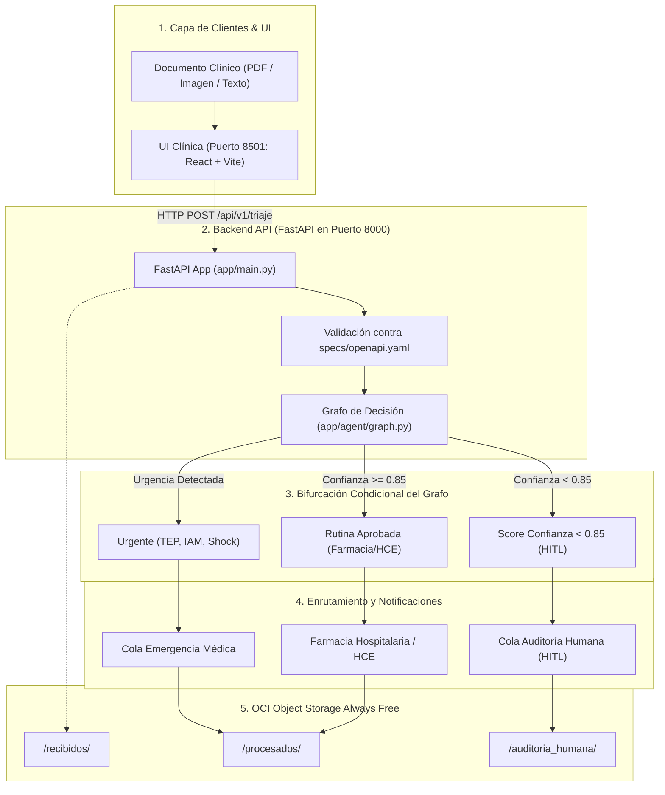

# 🏥 Software Design Document (SDD) – MediFlow
**Agente Autónomo para Triaje, Extracción y Enrutamiento de Documentos Clínicos**  
*Hackathon ONE Grupo 10 (Oracle Next Education & Alura)*  
*Metodología: Spec-First / Schema-Driven Development (SDD)*  
*Arquitectura:* FastAPI + LangGraph + OCI Compute Ampere A1 Always Free + React (Vite)  
*Versión:* 2.0.0  

---

## 1. Visión General y Objetivos

### 1.1 Propósito
**MediFlow** es un sistema inteligente y autónomo diseñado para la ingesta, clasificación, extracción y enrutamiento de documentos clínicos y administrativos (recetas médicas, informes radiológicos, órdenes de estudios, certificados y epicrisis). El sistema reduce tiempos de espera, elimina errores de transcripción manual y prioriza de forma inmediata casos de urgencia médica crítica mediante un grafo de decisión condicional con soporte *Human-in-the-Loop* (HITL).

### 1.2 Objetivos de Arquitectura
1. **Spec-First Estricto:** La especificación [`specs/openapi.yaml`](file:///home/wigsdev/GitHub/mediflow/specs/openapi.yaml) (OpenAPI 3.0) es la única fuente de la verdad para backend y frontend.
2. **Backend de Alto Rendimiento:** FastAPI valida automáticamente los contratos Pydantic y ejecuta el grafo de decisión del agente clínico.
3. **Cloud-Native en OCI Always Free:** Despliegue en una máquina virtual **Ampere A1 (4 OCPU / 24 GB RAM)** sin costo, con autenticación segura mediante **IAM Instance Principal** (sin almacenar claves en disco).
4. **Almacenamiento Segregado:** Los estados reales residen en **OCI Object Storage** en 3 buckets (`/recibidos`, `/procesados`, `/auditoria_humana`). La VM es 100% descartable (*Stateless Compute*).
5. **CI/CD Automatizado:** Pruebas de contrato y linting en cada PR con GitHub Actions.

### 1.3 Stack Tecnológico del Sistema
Ecosistema técnico integrado para la arquitectura de MediFlow:

| Capa / Componente | Tecnología Seleccionada | Rol y Propósito en la Arquitectura |
|:---|:---|:---|
| **Contratos & Especificación** | **OpenAPI 3.0 + JSON Schema** | Metodología Spec-First con [`specs/openapi.yaml`](../specs/openapi.yaml) como única fuente de la verdad. |
| **Backend API** | **FastAPI + Pydantic v2** | Microservicio REST asíncrono y validación estricta de esquemas de triaje y extracción. |
| **IA & LLM Multimodal** | **Google Gemini 1.5 Pro / Flash** | Extracción de entidades clínicas, códigos **CIE-10** y OCR de documentos escaneados/manuscritos. |
| **Orquestación del Agente** | **LangGraph + n8n** | Grafo de decisión determinista para bifurcación condicional por severidad y score de confianza. |
| **Automatización de Flujos** | **n8n Core** (Puerto `5678`) | Disparadores por webhook y enrutamiento a canales de alerta hospitalaria (Slack/Email). |
| **Capa de Presentación (UI)** | **React 18 + Vite (TypeScript)** (Puerto `8501`) | Visualizador Split-Screen y panel de auditoría Human-in-the-Loop (HITL) 1-clic. |
| **Cloud Storage** | **OCI Object Storage** (3 Buckets) | Segregación de estados clínicos: `/recibidos/`, `/procesados/` y `/auditoria_humana/`. |
| **Cloud Compute** | **OCI Compute Ampere A1** (ARM64) | Instancia en nube (4 OCPUs, 24 GB RAM Always Free) con Docker Compose y Stateless Compute. |
| **Seguridad Cloud** | **OCI IAM Instance Principal** | Autenticación basada en identidad de la VM (Dynamic Groups), sin claves en disco. |
| **Calidad & CI/CD** | **Pytest + GitHub Actions** | Pruebas de contrato y pipeline de integración continua automatizado. |

---

## 2. Arquitectura Global del Sistema



---

## 3. Infraestructura Cloud (Oracle Cloud Infrastructure)

```
Región OCI: sa-santiago-1 (o asignada en Always Free)
Compartment: mediflow
├── IAM: Dynamic Group + Policy (Instance Principal)
├── VCN: mediflow-vcn (10.0.0.0/16) con Subnet Pública (10.0.0.0/24)
│   └── Ports abiertos: 22 (SSH), 8000 (FastAPI), 8501 (UI), 5678 (n8n opcional)
├── Compute Instance: Ampere A1 (4 OCPU / 24 GB RAM Always Free)
│   └── Docker Compose: backend-api (8000), ui (8501), n8n (5678)
└── Object Storage: mediflow-documentos-clinicos
    ├── /recibidos/
    ├── /procesados/
    └── /auditoria_humana/
```

---

## 4. Contratos de Datos y Especificación API

Todo el comportamiento de la API está documentado formalmente en:
* [`specs/openapi.yaml`](file:///home/wigsdev/GitHub/mediflow/specs/openapi.yaml): Especificación OpenAPI 3.0 con endpoints `/health`, `/api/v1/triaje`, `/api/v1/auditoria/{id}` y `/api/v1/metricas`.
* [`backend-api/app/models/schemas.py`](file:///home/wigsdev/GitHub/mediflow/backend-api/app/models/schemas.py): Modelos Pydantic v2.
* [`frontend/scripts/generate-api.sh`](file:///home/wigsdev/GitHub/mediflow/frontend/scripts/generate-api.sh): Autogeneración de tipos TypeScript desde la spec.
