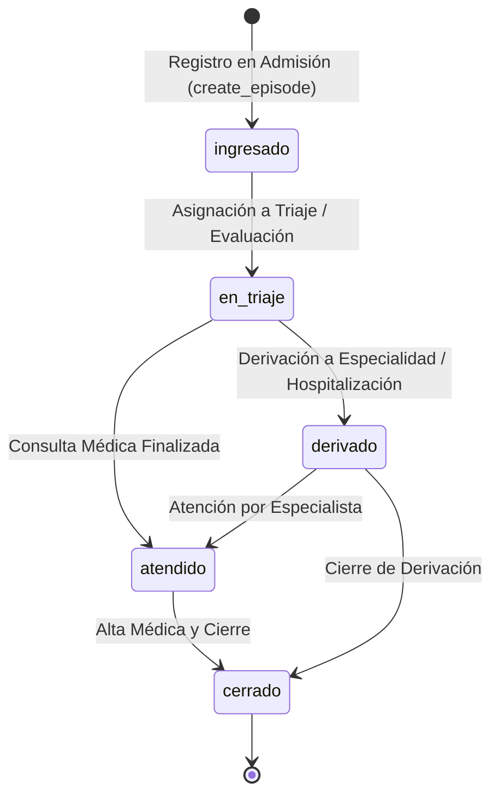

# Data Model: Gestión de Episodios Clínicos

**Feature**: [spec.md](./spec.md) | **Date**: 2026-10-05

---

## 1. Entidades y Esquema de Base de Datos

### Tabla: `episodios_clinicos` (Escritura / Persistencia Base)

| Campo | Tipo | Restricciones | Descripción |
|---|---|---|---|
| `id` | `UUID` | `PRIMARY KEY`, Default `uuid_generate_v4()` | Identificador único del episodio clínico |
| `codigo_episodio` | `VARCHAR(50)` | `UNIQUE`, `NOT NULL` | Código legible único (ej. `EP-20261005-A1B2`) |
| `paciente_id` | `UUID` | `REFERENCES pacientes(id) ON DELETE SET NULL` | Paciente asociado al episodio |
| `operador_ingreso_id` | `UUID` | `REFERENCES usuarios(id) ON DELETE SET NULL` | Usuario que registró el ingreso en admisión |
| `medico_general_id` | `UUID` | `REFERENCES usuarios(id) ON DELETE SET NULL` | Médico general asignado |
| `medico_especialista_id` | `UUID` | `REFERENCES usuarios(id) ON DELETE SET NULL` | Médico especialista asignado |
| `especialidad_requerida`| `VARCHAR(100)`| Nullable | Especialidad médica necesaria para el caso |
| `estado_atencion` | `VARCHAR(50)` | `NOT NULL`, Default `'ingresado'` | Estado del ciclo de atención médica |
| `nivel_prioridad` | `VARCHAR(20)` | `NOT NULL`, Default `'Rutina'` | Nivel de urgencia / triaje |
| `motivo_consulta` | `TEXT` | Nullable | Razón de ingreso expresada por el paciente |
| `diagnostico_general` | `TEXT` | Nullable | Diagnóstico preliminar o general |
| `diagnostico_especialista` | `TEXT` | Nullable | Diagnóstico definitivo emitido por especialista |
| `created_at` | `TIMESTAMPTZ` | `NOT NULL`, Default `NOW()` | Fecha y hora de creación |
| `updated_at` | `TIMESTAMPTZ` | `NOT NULL`, Default `NOW()` | Fecha y hora de última actualización |

---

### Vista: `v_episodios_detalle` (Lectura Enriquecida)

Proyecta todos los campos de `episodios_clinicos` más:
- **Paciente**: `paciente_tipo_documento`, `paciente_numero_documento`, `paciente_historia_clinica`, `paciente_nombres`, `paciente_apellidos`, `paciente_nombre_completo`, `paciente_fecha_nacimiento`, `paciente_edad` (cálculo dinámico en años), `paciente_genero`, `paciente_numero_telefono`, `paciente_correo`.
- **Operador**: `operador_ingreso_nombre`.
- **Médico General**: `medico_general_nombre`, `medico_general_especialidad`.
- **Médico Especialista**: `medico_especialista_nombre`, `medico_especialista_especialidad`.

---

## 2. Máquina de Estados del Episodio (`estado_atencion`)

### Estados Permitidos:
1. `ingresado`: Episodio creado en recepción / admisión.
2. `en_triaje`: Evaluación de enfermería o triaje en progreso.
3. `atendido`: Evaluación médica general completada.
4. `derivado`: Transferido a médico especialista o interconsulta.
5. `cerrado`: Ciclo de atención finalizado.
