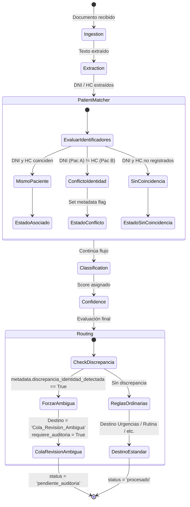

# Data Model & State Transitions: Resolución de Identidad y Conflictos DNI/HC

**Feature**: `004-patient-matcher-conflicts` (`[IA-02]`, Issue `#29`)  
**Date**: 2026-10-05  

---

## 1. Modificaciones en el Estado del Agente (`AgentState`)

El modelo `AgentState` existente en `backend/app/agent/state.py` se utiliza sin romper contratos previos, aprovechando el campo extensible `metadata: dict` y los campos de `DatosExtraidosState` y `DecisionEnrutamientoState`.

### Estructura de `state.metadata` ante Detección de Conflicto

```json
{
  "discrepancia_identidad_detectada": true,
  "motivo_ambiguedad": "conflicto_identidad_dni_hc",
  "dni_detectado": "12345678",
  "hc_detectada": "HC-99999",
  "paciente_dni_id": "a0eebc99-9c0b-4ef8-bb6d-6bb9bd380a11",
  "paciente_hc_id": "b1ffbc88-8d1c-4fe9-aa5e-5cc8ac271b22"
}
```

---

## 2. Modelos Pydantic del Matcher (`app/agent/patient_matcher.py`)

```python
from typing import Literal, Any
from pydantic import BaseModel, Field

class ResultadoMatchingPaciente(BaseModel):
    """Resultado del cotejo de identificadores clínicos."""
    estado: Literal["asociado", "sin_coincidencia", "conflicto"]
    paciente: dict[str, Any] | None = None
    es_conflicto: bool = False
    motivo: str | None = None
    dni_evaluado: str | None = None
    hc_evaluada: str | None = None
```

---

## 3. Diagrama de Transición de Estados


